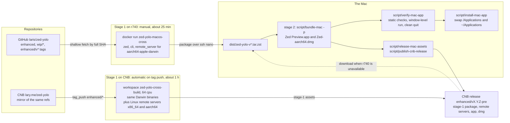
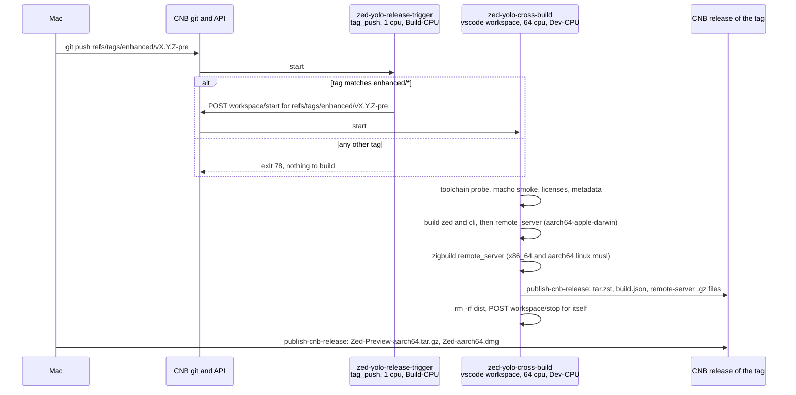
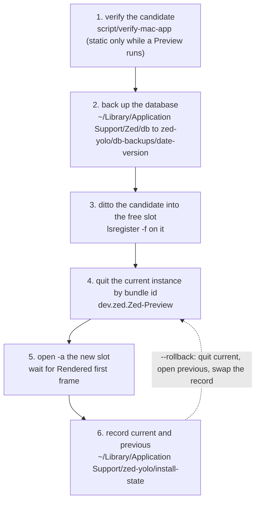
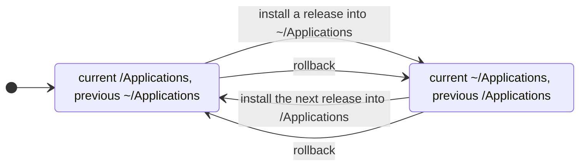
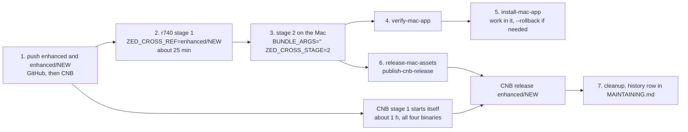

# Building, verifying and releasing zed-yolo

> The build guide for the `laris/zed-yolo` fork. MAINTAINING.md covers the
> patch set and the weekly upstream checkpoint; this file covers everything
> from "the branch is ready" to "the new Zed Preview is running and the
> release is on CNB". Every step names the script that does it and the manual
> check that proves it worked. Scripts are conveniences; the checks are the
> contract.

## 0. The shape of a build

Four binaries ship per release, all for the fork's single desktop target,
Apple Silicon macOS, plus remote servers:

| Asset | Built by | Needs a Mac? |
| ----- | -------- | ------------ |
| `Zed-Preview-aarch64.tar.gz` and `Zed-aarch64.dmg` (the `.app`) | stage 1 compiles `zed` and `cli`; stage 2 assembles, signs and packages | Only stage 2: `cargo bundle`, `codesign`, `hdiutil` |
| `zed-remote-server-macos-aarch64.gz` | stage 1 | No |
| `zed-remote-server-linux-x86_64.gz` (static musl) | stage 1 on CNB (zig cross-link) | No |
| `zed-remote-server-linux-aarch64.gz` (static musl) | stage 1 on CNB (zig cross-link) | No |

**Stage 1** cross-compiles on an x86_64 Linux Docker host inside the image
built from `.cnb/Dockerfile.zed-macos` (Debian clang 19 + `ld64.lld`, macOS
SDK 26.1, Rust 1.97.1, sccache). It runs on two hosts that do not conflict:

- **r740** (`mtbc-r740-09`, 64 threads): manual, about 25 minutes warm.
  Darwin binaries only, because zig cannot run on its CentOS 7 kernel.
- **CNB** (`lary.me/zed-yolo`): automatic on an `enhanced/*` tag push, or
  started by hand. Darwin binaries and both Linux remote servers, published
  straight to the tag's CNB release.

**Stage 2** runs on the Mac: `script/bundle-mac -p` turns the stage-1
package into `Zed Preview.app`, ad-hoc signed, and a DMG.

**Then**: verify (`script/verify-mac-app`), switch the installed app
(`script/install-mac-app`), publish the Mac assets (`script/release-mac-assets`,
`script/publish-cnb-release`), clean up.



Wrapper conventions from MAINTAINING.md §0 apply: `$GH` for anything that
reaches GitHub (the Linux host fetches the commit from GitHub; `bundle-mac`
downloads dugite `git`), `$CNB_API` / the `cnb` CLI for CNB, never through the
proxy and never by reading the macOS keychain yourself.

```bash
GH=/Users/lqiao/.codex/skills/audit-clean-sync-repo/scripts/run_github_proxy.sh
CNB=/Users/lqiao/.codex/skills/audit-clean-sync-repo/scripts/run_cnb_git_no_keychain.sh
CNB_API=/Users/lqiao/.codex/skills/audit-clean-sync-repo/scripts/run_cnb_no_proxy.sh
export ZED_CROSS_SSH='ssh -o BatchMode=yes nano ssh -o BatchMode=yes -i ~/.ssh/id_ed25519.bjnbulab2025.pri laris@10.75.71.58'
```

When the tool shell is zsh (agent harness), spell the SSH prefix out in
commands instead of `$ZED_CROSS_SSH …`: zsh does not word-split an unquoted
variable. Bash scripts, including `script/cross-build-remote`, are unaffected.

## 1. One-time setup

### 1.1 Mac

- Xcode Command Line Tools (the Metal Toolchain is not needed: every build
  uses `gpui_platform/runtime_shaders`).
- The Zed fork of `cargo-bundle`:
  `$GH cargo install cargo-bundle --git https://github.com/zed-industries/cargo-bundle.git --branch zed-deploy`
- For DMGs: `npm install -g dmg-license minimist` (`bundle-mac` does this
  itself when missing, through Homebrew's `npm`).
- The CNB CLI: `npm install -g @cnbcool/cnb-cli` then `cnb login`
  (OAuth device flow; the token lands in the login keyring, which only the
  CLI reads).
- `python3`, `jq`, `zstd`.

### 1.2 Linux build host (r740 or any Docker host)

Requirements: Docker usable by your user; outbound access to GitHub,
`static.crates.io`, `ghcr.io`, `deb.debian.org` and
`raw.githubusercontent.com`; about 9 GB for the image, 30 GB for the
`target` volume, up to 80 GB for sccache. The kernel does not matter
(validated on CentOS 7 / 3.10); the image is Debian trixie with its own glibc.

```bash
# Build the image (~10 min). It is self-contained: no build context needed.
$ZED_CROSS_SSH 'mkdir -p ~/zed-yolo-cross && cat > ~/zed-yolo-cross/Dockerfile.zed-macos' \
  < .cnb/Dockerfile.zed-macos
$ZED_CROSS_SSH 'cd ~/zed-yolo-cross && docker build -t zed-yolo-macos-cross -f Dockerfile.zed-macos .'
```

`script/cross-build-remote` creates the checkout (`~/src/zed-yolo`) and the
named volumes (`zed-yolo-{cargo-registry,cargo-git,sccache,target}`) on first
use, and rebuilds the image itself when `ZED_CROSS_REBUILD_IMAGE=1`.

The Darwin link needs `__isPlatformVersionAtLeast` from compiler-rt. The image
builds that one object from LLVM's `os_version_check.c` (Apache-2.0 with LLVM
exception), so nothing else is required. If Apple's own archive is wanted
instead, place the arm64 slice at `~/.cache/zed-yolo-cross/libclang_rt.osx.a`
on the Linux host and the wrapper prefers it:

```bash
lipo -thin arm64 "$(dirname "$(xcrun --find clang)")/../lib/clang/"*/lib/darwin/libclang_rt.osx.a -output /tmp/libclang_rt.osx.a
$ZED_CROSS_SSH 'mkdir -p ~/.cache/zed-yolo-cross && cat > ~/.cache/zed-yolo-cross/libclang_rt.osx.a' < /tmp/libclang_rt.osx.a
```

### 1.3 CNB

Nothing to install. `.cnb.yml` in the repository defines two pipelines under
the `$` catch-all (both events are repository-level):

| Pipeline | Event | Pool | Size | Purpose |
| -------- | ----- | ---- | ---- | ------- |
| `zed-yolo-release-trigger` | `tag_push` | Build-CPU (160 core-h/month) | 1 cpu, seconds | For an `enhanced/*` tag, `POST …/workspace/start` for that tag, then exit |
| `zed-yolo-cross-build` | `vscode` (workspace) | Dev-CPU (1600 core-h/month) | 64 cpu / 128 GiB | Stage 1 for all four binaries, publish to the tag's release, stop itself |



A workspace pipeline is a build pipeline that declares `services: [vscode]`;
that one line moves it from the 160-hour pool to the 1600-hour pool. Cost is
`cpus × wall-clock hours`: a 64-cpu build of about one hour is 64 core-hours,
so a weekly release uses roughly 280 of 1600 per month. Check usage with:

```bash
curl -sS https://api.cnb.cool/lary.me/-/charge/volume | jq '{build_h: (.ci_in_sec/3600), dev_h: (.dev_in_sec/3600)}'
```

Caches (`docker.volumes`) are node-local and pipelines rotate over a few build
nodes, so some CNB runs start cold. The image is rebuilt only when the
Dockerfile or `rust-toolchain.toml` changes (`versionBy`); CNB built it in
5.6 min. The container runs under user namespaces, and `:rw` volumes are
root-owned host directories the namespaced root cannot write (`Permission
denied` even on fresh volumes, 2026-09-14). The volumes therefore use CNB's
default copy-on-write type: an overlay that is writable during the run and
merged into the volume when the pipeline succeeds.

## 2. Stage 1: compile on Linux

### 2.1 r740, by hand

The commit must be reachable on GitHub (`enhanced`, a `wip/*` branch, or a
tag); the Linux host shallow-fetches it by full SHA, so nothing but commands
leaves the Mac.

```bash
$GH git push github 'refs/heads/wip/<topic>:refs/heads/wip/<topic>'   # if not on enhanced yet

ZED_CROSS_STAGE=1 $GH script/cross-build-remote                          # HEAD → dist/<package>.tar.zst
ZED_CROSS_REF=enhanced/v1.21.0-pre ZED_CROSS_STAGE=1 $GH script/cross-build-remote   # a tag
ZED_CROSS_REBUILD_IMAGE=1 ZED_CROSS_STAGE=1 $GH script/cross-build-remote            # after a Dockerfile change
ZED_CROSS_RELEASE_CHANNEL=dev $GH script/cross-build-remote                          # side-by-side test build (§4.3)
```

The driver runs, inside the container as root with the named volumes:
`macho-smoke` → `generate-licenses` → `metadata` → `build … zed cli` →
`build … remote_server` → `package`, then chowns `dist/` back and writes
`dist/LATEST`. Output on the Linux host and, after transfer and checksum
verification, in the Mac's `dist/`:

```text
zed-yolo-v<ver>[-<channel>]-aarch64-apple-darwin-<yyyymmdd>-g<sha8>.tar.zst   zed, cli, remote_server, RELEASE_CHANNEL
…tar.zst.sha256, …tar.zst.build.json                                          checksum, provenance (commit, seconds, channel)
zed-remote-server-macos-aarch64.gz (+ .sha256)                                 stays on the Linux host; the Mac produces its own
```

Every stage 1 begins by wiping `dist/` on the Linux host, so earlier packages
survive only in the Mac's `dist/`.

Measured on r740 (2× Xeon Silver 4216, 64 threads, 125 GiB): image build
10 min; cold stage 1 about 40 min; warm 21 min (6 of them the `zed` link); a
channel switch recompiles `release_channel` and its dependents, 18 to 28 min
(2026-09-14 12:20: `zed`+`cli` 503 s, `remote_server` 252 s, package 46 s,
1,093 s in total); the 113 MB package crosses the two SSH hops in 8 to 60 s.

### 2.2 CNB, automatically or by hand

Pushing an `enhanced/*` tag to CNB (MAINTAINING.md §4.7) fires the trigger
pipeline, which starts the build workspace for that tag. To start it by hand,
for any branch or tag:

```bash
# The CLI's start-workspace subcommand rejects the branch parameter (2026-09);
# call the API through the token-injecting git wrapper instead.
$CNB bash -c 'curl -sS -X POST -H "Authorization: Bearer $CNB_TOKEN" -H "Content-Type: application/json" \
  -d "{\"branch\":\"<branch-or-tag>\"}" https://api.cnb.cool/lary.me/zed-yolo/-/workspace/start'
# → {"sn":"cnb-…","buildLogUrl":…}. If it returns only {"url":…}, a workspace for
# that branch already exists (possibly closed) and was reused; delete it first:
#   … -d '{"sn":"<sn>"}' https://api.cnb.cool/workspace/delete
# Follow it:
$CNB bash -c 'curl -sS -H "Authorization: Bearer $CNB_TOKEN" https://api.cnb.cool/lary.me/zed-yolo/-/build/status/<sn>' | jq
$CNB_API workspace list-workspaces --slug lary.me/zed-yolo --status running -v
```

The stages mirror `.cnb/cross-build-macos.sh`, then add the two Linux
remote servers (`cargo zigbuild`, static musl) and `publish-release`, which
uploads every `dist/zed-yolo-v*.tar.zst*` and `dist/zed-remote-server-*.gz*`
to the CNB release of the tag with `script/publish-cnb-release` (skipped when
the ref is not an `enhanced/*` tag). The last stage removes `dist/` (the
workspace backup is capped at 100 MB) and an end stage stops the workspace;
`keepAliveTimeout: 10m` reclaims it if that call fails. Follow progress in
the CNB build UI; the API returns a stage's log only after the stage ends.

Measured 2026-09-14 (64 cpu, cold caches, branch build): image 5.6 min on
the first run and 36 s cached afterwards; licenses 293 s; `zed`+`cli` 831 s;
`remote_server` 608 s; Darwin package 30 s; each Linux remote server 740 s
plus 80 s packaging; 58 min end to end, about 62 core-hours of the Dev pool.
The Darwin link used only the compiler-rt archive built into the image. Three
earlier attempts failed within seconds on `:rw` volumes, an omitted volume
type and a reused closed workspace (§8.2).

Fetch the Darwin package to the Mac for stage 2:

```bash
TAG=enhanced/v1.21.0-pre
$CNB_API releases get-release-by-tag --repo lary.me/zed-yolo --tag "$TAG" -v | jq -r '.data.assets[].name'
for f in $($CNB_API releases get-release-by-tag --repo lary.me/zed-yolo --tag "$TAG" -v | jq -r '.data.assets[].name | select(test("aarch64-apple-darwin"))'); do
  url=$($CNB_API releases get-releases-asset --repo lary.me/zed-yolo --tag "$TAG" --filename "$f" --share -v | jq -r '.data.url // .data.download_url')
  curl -fsSL --noproxy '*' -o "dist/$f" "$url"
done
shasum -a 256 -c dist/zed-yolo-v*-aarch64-apple-darwin-*.tar.zst.sha256
```

### 2.3 Which one to use

Run both when a release is due: push the tag, then start r740. The r740
package is normally ready first and is what stage 2 uses; the CNB run is the
proof that the pipeline still works and it is the only producer of the Linux
remote servers. If they disagree in `.build.json` `commit`, one of them built
the wrong ref; stop.

## 3. Stage 2: bundle on the Mac

```bash
BUNDLE_ARGS='' ZED_CROSS_STAGE=2 $GH script/cross-build-remote   # newest dist/ package → .app + DMG (default for releases)
ZED_CROSS_STAGE=2 $GH script/cross-build-remote                  # -i: install straight into /Applications (test builds)
```

`script/bundle-mac -p <dir>` (MAINTAINING.md §3.7 block D) validates the
Mach-O load commands, copies the three binaries into
`target/aarch64-apple-darwin/release/`, sets `CARGO_BUNDLE_SKIP_BUILD=true` so
`cargo bundle` only assembles the `.app`, then runs upstream's unchanged tail:
`Document.icns`, dugite `git`, ad-hoc `codesign` with entitlements, DMG or
`-i` install, `remote_server` gzip. `dsymutil` is skipped (the objects are on
the Linux host). The copies are removed afterwards so a later native
`cargo build` relinks instead of trusting them. The release channel comes from
the package's `RELEASE_CHANNEL`, so a `dev` package becomes `Zed Dev.app`.

Outputs: `target/aarch64-apple-darwin/release/dmg/Zed Preview.app`,
`target/aarch64-apple-darwin/release/Zed-aarch64.dmg`,
`target/zed-remote-server-macos-aarch64.gz`. About 50 s.

## 4. Verify

### 4.1 The script

```bash
script/verify-mac-app "target/aarch64-apple-darwin/release/dmg/Zed Preview.app"
script/verify-mac-app --report /tmp/zed-verify.txt "/Applications/Zed Dev.app"
```

It always runs the static checks (Mach-O type and `LC_BUILD_VERSION`,
duplicate dylib load commands, `codesign --verify --deep --strict`,
`zed --system-specs`). Then, if no Zed of the candidate's channel is running,
it launches the candidate with a fresh `--user-data-dir` and
`ZED_GENERATE_MINIDUMPS=1`, waits for `Rendered first frame`, counts errors
and panics, confirms its own PID is the only instance of that bundle id,
quits it through that bundle id (a real Cmd+Q, so the crash-handler shutdown
of MAINTAINING.md §3.6 runs), and checks that the handler exited and no
`DiagnosticReports` appeared. If a Zed of that channel is running it says so
and stops; a second instance would only hand off to it.

Expected noise: every quit logs `ERROR [gpui::app] timed out waiting on
app_will_quit` (gpui's 200 ms `SHUTDOWN_TIMEOUT`); native builds do the same.

### 4.2 The same checks by hand

When the script is unavailable or fails halfway, these are the checks it
encodes, in order. A cross-built app that passes them behaves like a native
one; one that fails any of them must not be installed.

1. `file "<app>/Contents/MacOS/zed"` → `Mach-O 64-bit executable arm64`.
2. `otool -l "<app>/Contents/MacOS/zed" | grep -A4 LC_BUILD_VERSION` →
   platform 1, minos 11.0, sdk 26.1.
3. `python3 script/check-macho-dylibs.py "<app>/Contents/MacOS/zed" "<app>/Contents/MacOS/cli"` → no duplicates.
4. `codesign --verify --deep --strict "<app>"` → silent; `codesign -dvv` shows `Signature=adhoc`.
5. `"<app>/Contents/MacOS/zed" --system-specs` → prints `Zed: v<ver>+preview.<sha>` and
   the `Enhanced` marker; this loads every framework and runs the static
   constructors without a window.
6. Launch with a throwaway profile from Terminal, not from a terminal inside Zed:
   `ZED_GENERATE_MINIDUMPS=1 "<app>/Contents/MacOS/zed" --user-data-dir /tmp/zed-check &`,
   then in `~/Library/Logs/Zed/Zed.log` expect `starting zed version …`,
   `Rendered first frame`, no `panicked at`, and a `--crash-handler` child in
   `ps -axo pid,ppid,args | grep crash-handler`.
7. Quit it: `osascript -e 'tell application id "dev.zed.Zed-Preview" to quit'`
   (this reaches every Preview instance, so make sure yours is the only one).
   The main process and the crash handler exit within seconds; no new
   `~/Library/Logs/DiagnosticReports/Zed*` file appears. A report with
   `EXC_GUARD` means the minidumper workaround is missing (MAINTAINING.md §7.5).
8. In the app: About shows the `Enhanced` title; an ACP agent's permission
   prompt is auto-approved when `agent.enhanced_yolo.enabled` is true;
   editing works; the window closes cleanly.

### 4.3 Testing while the IDE that hosts you is running

Every Zed build shares the process name; all builds of one channel share the
bundle id `dev.zed.Zed-Preview` and a per-user single-instance port. A
second Preview hands off to the running one, and any quit or kill by name or
bundle id reaches the IDE hosting an agent session. So:

- From an agent inside Zed: build the candidate as a test channel
  (`ZED_CROSS_RELEASE_CHANNEL=dev …`, installs `Zed Dev.app` with its own
  bundle id and port) and verify that. It is the same commit, toolchain and
  flags; only the channel constant differs.
- From Terminal: verify the real artifact directly; nothing of yours is at risk.
- Never `pkill -f zed`, `killall zed`, or `osascript … "Zed Preview"` from
  inside Zed. Stop test processes by PID.

## 5. Install and switch

Two slots hold `Zed Preview.app`: `/Applications` and `~/Applications`. One
is the version in use, the other the previous version kept for rollback. A
new release goes into the slot holding the previous version, and the roles
swap. `script/install-mac-app` does this from Terminal (it refuses to run
inside a Zed terminal):

```bash
script/install-mac-app                       # candidate = target/aarch64-apple-darwin/release/dmg/Zed Preview.app
script/install-mac-app --status              # which slot is current, which is previous
script/install-mac-app --rollback            # quit current, open previous, swap the record
script/install-mac-app --dry-run             # print the plan
```





Steps it performs: verify the candidate (§4.1, static only while the current
Preview runs); copy `~/Library/Application Support/Zed/db` to
`~/Library/Application Support/zed-yolo/db-backups/<date>-<version>/` (three
kept); `ditto` the candidate into the free slot; `lsregister -f` it; quit the
current instance by bundle id; `open -a` the new slot; wait for
`Rendered first frame`; record `current`/`previous` in
`~/Library/Application Support/zed-yolo/install-state`.

Known consequences of two bundles with one bundle id:

- LaunchServices may route `zed://` links, "Open with" and Spotlight to either
  copy. `lsregister -f` on the new slot after each switch makes it the most
  recently registered; if links open the wrong one, use Finder → Get Info →
  Open with → Change All on the current slot.
- Both versions share one data dir. Migrations are forward-only; after
  rolling back, if the older version refuses the database, restore the
  matching folder from `db-backups/` while Zed is not running.
- Do not run both at once; the second one hands off to the first.

## 6. Release to CNB

Releases live on CNB (`lary.me/zed-yolo`), keyed by the Git tag
`enhanced/vX.Y.Z-pre` (or `-pre.N` for a re-spin, `vX.Y.Z` for a final).
The CNB pipeline uploads the stage-1 assets; the Mac adds the bundle:

```bash
TAG=enhanced/v1.21.0-pre
script/release-mac-assets --tag "$TAG"                         # → dist/release/enhanced-v1.21.0-pre/
script/publish-cnb-release --tag "$TAG" dist/release/enhanced-v1.21.0-pre/*
$CNB_API releases get-release-by-tag --repo lary.me/zed-yolo --tag "$TAG" -v | jq -r '.data.assets[].name'
```

Expected assets of a complete release:

```text
Zed-Preview-aarch64.tar.gz (+ .sha256)           the .app (Mac)
Zed-aarch64.dmg                                   (Mac)
zed-remote-server-macos-aarch64.gz (+ .sha256)    (Mac or CNB; identical content)
zed-remote-server-linux-x86_64.gz (+ .sha256)     (CNB)
zed-remote-server-linux-aarch64.gz (+ .sha256)    (CNB)
zed-yolo-v*-aarch64-apple-darwin-*.tar.zst (+ .sha256, .build.json)   stage-1 package (CNB)
```

`publish-cnb-release` creates the release if missing (prerelease when the tag
contains `-pre`) and overwrites same-named assets, so it can be re-run.
Tags are immutable: a failed build after the tag exists gets a new
`-pre.N` re-spin tag (MAINTAINING.md §11), never a moved tag.

## 7. The weekly cadence, build part

After MAINTAINING.md §4 has rebased `enhanced`, run `cargo check`, and created
the `enhanced/<NEW>` tag:



1. Push `enhanced` and the tag to GitHub, then to CNB (§4.5–4.7). The CNB tag
   push starts the CNB stage 1.
2. `ZED_CROSS_REF=enhanced/<NEW> ZED_CROSS_STAGE=1 $GH script/cross-build-remote` on r740.
3. `BUNDLE_ARGS='' ZED_CROSS_STAGE=2 $GH script/cross-build-remote`.
4. `script/verify-mac-app "target/aarch64-apple-darwin/release/dmg/Zed Preview.app"` from Terminal, or the §4.2 list.
5. `script/install-mac-app`; work in the new version for a while; `--rollback` if needed.
6. When the CNB run has published its assets: `script/release-mac-assets --tag enhanced/<NEW>` and `script/publish-cnb-release --tag enhanced/<NEW> dist/release/*/*`.
7. §9 cleanup. Record timings and results in MAINTAINING.md §10.

## 8. Troubleshooting

### 8.1 Toolchain (every line cost one failed build)

| Symptom | Cause | Where it is handled |
| ------- | ----- | ------------------- |
| `zig cc`: `failed to create path 'z' in local cache directory: Unexpected` | zig ≥ 0.14 uses `statx(2)`; kernel 3.10 returns `ENOSYS`. | Darwin uses clang + `ld64.lld`; zig only for Linux targets, only on CNB. |
| zig 0.14/0.15: `unable to parse SDK version`; zig ≤ 0.13: `undefined symbol: section$end$__DATA$_CTOR0_ISIZE_FN` | SDK 26 version string; pre-0.14 zig lacks `section$start/end`. | Same. |
| `aws-lc-sys`: `NEON and crypto extensions should be statically available` | C compiler defaults to a generic arm64 CPU. | Wrapper passes `-mcpu=apple-m1`. |
| C++: `non-defining declaration of enumeration with a fixed underlying type` | Non-Apple clang errors on `CF_ENUM`. | `aarch64-apple-darwin-clang++` passes `-Wno-elaborated-enum-base`. |
| `gpui_apple` build script: `unresolved import cbindgen` | Cargo evaluates `cfg(target_os)` build-dependencies against the host. | Un-gated `[build-dependencies]` in `crates/gpui_apple/Cargo.toml`. |
| `ld64.lld: undefined symbol: __isPlatformVersionAtLeast` | compiler-rt builtin behind `@available`; rustc passes `-nodefaultlibs`. | Wrapper appends `libclang_rt.osx.a` (built from LLVM source in the image, or Apple's mounted slice). |
| `ld64.lld: relocation BRANCH26 is out of range` in `__ctor_private` | `__text` exceeds the 128 MiB `bl` reach and `ctor` code sits in `__text_startup`. | Wrapper passes `-Wl,-rename_section,__TEXT,__text_startup,__TEXT,__text`. |
| `fatal: couldn't find remote ref <short sha>` on the Linux host | Fetching by object id needs the full 40-hex id. | `cross-build-remote` resolves `^{commit}`. |
| Package or `dist/LATEST` owned by root / `Permission denied` | The container runs as root. | Driver chowns `dist/` before writing `LATEST` and on exit. |
| `cargo bundle` tries to compile on the Mac | `CARGO_BUNDLE_SKIP_BUILD` unset or the `cargo-bundle` fork missing. | `bundle-mac -p` exports it; install the `zed-deploy` branch (§1.1). |
| Cross-built app lacks `-ObjC`, weak frameworks or the SDK-26 title-bar layout | A `build.rs` gated on the host. | MAINTAINING.md §3.4: gate on `CARGO_CFG_TARGET_OS`; extend the shim when upstream adds another. |

### 8.2 CNB

| Symptom | Cause | Fix |
| ------- | ----- | --- |
| Build killed mid-run, no error | Pre-freeze found insufficient quota (5-minute metering). | Check `charge/volume`; the Dev pool resets monthly. A pipeline without `services: [vscode]` bills the small Build pool. |
| Trigger pipeline exits with code 78 | The tag is not `enhanced/*`. | Intended. |
| Trigger pipeline `403` on `workspace/start` | The pipeline token lacks `repo-cnb-trigger`. | Start by hand: `$CNB_API workspace start-workspace --repo lary.me/zed-yolo --branch <tag>`. |
| Workspace keeps running after the stages | Self-stop failed. | `keepAliveTimeout: 10m` reclaims it; or `$CNB_API workspace workspace-stop`. |
| `workspace/start` returns only a `url` and nothing runs | A workspace for that branch exists (even `closed`) and is reused. | `POST /workspace/delete {"sn": …}`, then start again. |
| `Permission denied` under `/usr/local/cargo` or `/var/cache/sccache` | Volume declared with an explicit `:rw` type under user namespaces. | Use the default copy-on-write type (no suffix) in `.cnb.yml` (§1.3). |
| Stage 2 on the Mac: `set ZED_CROSS_SSH …` | Old `cross-build-remote` required the prefix for every stage. | Fixed 2026-09-14; stage 2 alone needs no SSH. |
| `package_size_exceeded` at workspace end | Build output left in the worktree (100 MB backup cap). | The `cleanup-workspace-dist` stage removes `dist/`; `target/` is a volume. |
| Image rebuilt on every run | `versionBy` includes a file that changes weekly. | Keep it to the Dockerfile and `rust-toolchain.toml`. |
| `publish-release` fails with `no upload ticket` | API response shape changed. | The script prints the raw response; adjust the `jq` paths. |

### 8.3 Mac

| Symptom | Cause | Fix |
| ------- | ----- | --- |
| `zed is already running` and exit 0 | Single-instance port of that channel is taken. | Quit the running Preview (from Terminal) or use a `dev` build (§4.3). |
| `bundle-mac -i`: `is running; quit it first` | Guard against replacing the running bundle. | Use `BUNDLE_ARGS=''` and `install-mac-app`. |
| "Zed quit unexpectedly" | Crash handler died on quit → minidumper workaround missing. | MAINTAINING.md §7.5. Only reachable with `ZED_GENERATE_MINIDUMPS=1`. |
| `zed://` link opens the wrong version | Two bundles, one bundle id. | §5: `lsregister -f`, or Finder → Open with → Change All. |
| Old version refuses to start after rollback | Database migrated by the newer version. | Restore from `db-backups/` (§5) with Zed quit. |
| DMG step: `dmg-license` missing | Global npm package absent. | `npm install -g dmg-license minimist`, or use `-i`. |
| `Zed Preview.app` from stage 2 checks for updates | `ZED_UPDATE_EXPLANATION` not compiled in. | Stage 1 sets it (`cross-build-macos.sh`, `.cnb.yml`); check `--system-specs` build env. |

## 9. Cleanup

```bash
rm -rf dist/zed-yolo-v*/ dist/release/            # extracted packages and staged assets; keep the .tar.zst you may re-bundle
rm -rf target/aarch64-apple-darwin/release/{dmg,bundle} target/aarch64-apple-darwin/release/Zed-aarch64.dmg
ls ~/Library/Application\ Support/zed-yolo/db-backups/    # three newest are kept automatically
$CNB_API workspace list-workspaces --slug lary.me/zed-yolo --status running -v   # must be empty
```

On the Linux host the volumes persist on purpose (warm cache). `docker volume
rm zed-yolo-target zed-yolo-sccache` resets them; the next build is cold.
