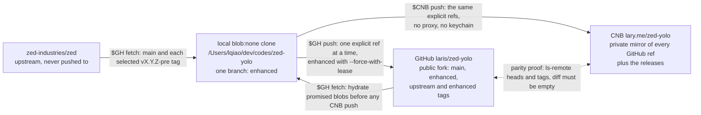
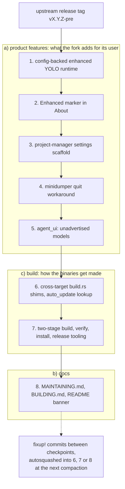
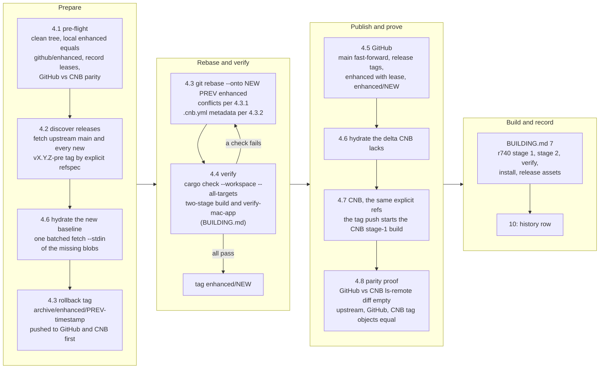

# Maintaining the laris/zed-yolo fork

> **Purpose of this document.** This is the long-term operating manual for the
> `laris/zed-yolo` fork of [zed-industries/zed][upstream]. It documents what we
> carry on top of upstream, how to upgrade to a new upstream version, how to
> verify the result, and how to contribute fixes back. Future maintainers
> (including future-you) should read this end-to-end before any upstream
> bump.

[upstream]: https://github.com/zed-industries/zed

---

## 0. Authoritative operating policy

This fork is maintained from **one local partial clone**:
`/Users/lqiao/dev/codes/zed-yolo`. A full clone of upstream is not needed
for routine upgrades or provider synchronization.

The legacy full clone at
`/Users/lqiao/dev/codes-repos/gh-zed-industries__zed` was removed on
2026-07-01 after its worktree, branches, tags, provider parity, and editor
references were verified. It is not a dependency of this workflow.

The normal checkpoint is the end of upstream's Friday workday. Because this
workstation uses Asia/Shanghai time, run the checkpoint on **Saturday at or
after 16:00 CST**, which safely covers Friday 23:59 in
America/Los_Angeles during daylight-saving time. The assumption that upstream
usually pauses on weekends is only a scheduling heuristic, not a guarantee.
Security fixes, urgent hotfixes, and releases published after the checkpoint
must be handled immediately or at the next checkpoint.

At each checkpoint:

1. Mirror every newly published upstream release tag since the prior
   checkpoint, not only the newest tag.
2. Select the newest non-draft `vX.Y.Z-pre` or `vX.Y.Z` GitHub Release as the
   new `enhanced` baseline. Use GitHub's `published_at` timestamp; do not rely
   on lexicographic tag sorting.
3. Snapshot upstream `main` at the checkpoint and fast-forward the fork's
   `main` to it. `enhanced` remains based on the selected release tag, not on
   the possibly newer `main` snapshot.
4. Rebase and validate the fork-only commits on the selected release tag.
5. Publish only the changed refs to GitHub and then CNB, one explicit ref at a
   time.
6. Prove exact all-head/all-tag parity between `laris/zed-yolo` and CNB
   `zed-yolo`.

Two different guarantees must not be confused:

- **Release coverage:** every upstream release tag published by the checkpoint
  exists on GitHub and CNB with the same tag-object SHA.
- **Provider parity:** every branch and tag currently present in `laris/zed-yolo`
  has the same ref-object SHA in CNB `zed-yolo`.

This policy does **not** claim that CNB continuously mirrors every live
upstream feature branch. CNB is a release-aligned union mirror and may lag
upstream between Friday checkpoints by design. Existing historical upstream
branches can remain on both providers, but routine maintenance neither fetches
nor updates those ephemeral branches.

All commands below assume:

```bash
REPO=/Users/lqiao/dev/codes/zed-yolo
SYNC_TOOLS=/Users/lqiao/.codex/skills/audit-clean-sync-repo/scripts
GH=$SYNC_TOOLS/run_github_proxy.sh
CNB=$SYNC_TOOLS/run_cnb_git_no_keychain.sh
CNB_API=$SYNC_TOOLS/run_cnb_no_proxy.sh
cd "$REPO"
```

- `$GH` is mandatory for every GitHub API, Git, SSH, Cargo/Git dependency, or
  lazy partial-clone fetch; it routes traffic through `127.0.0.1:10808`.
- `$CNB` and `$CNB_API` are mandatory for CNB and always bypass proxies.
- Never read CNB credentials from macOS Keychain. Do not use `cnb-rs` for this
  large repository while its metadata requests return HTTP 403.

---

## 1. Why this fork exists

We maintain a small, focused patch set on top of upstream Zed to:

- **Run an "enhanced YOLO" agent mode** — auto-approve ACP permission requests
  and inject `ZED_YOLO*` env vars so agent-spawned processes inherit
  high-permission defaults. Configured via `settings.json`.
- **Carry a visible build marker** — "Enhanced" suffix in the About-dialog
  title, so we can tell our build apart from the official Preview.
- **Carry a project-manager settings scaffold** — placeholder schema for
  future workspace/agent management UI.
- **Carry the two-stage build and release tooling** — Linux-hosted
  cross-compilation of the macOS binaries (the r740 box by hand, CNB
  automatically), a Mac-side bundle step, a verifier, an install/rollback
  switch and CNB release publishing. BUILDING.md is the guide; §3.7 lists the
  tracked `script/bundle-mac` modifications.
- **Carry a macOS crash-on-quit workaround** — see §3.6 and upstream
  [#57664][i57664]/[#57950][i57950]/[PR #57951][pr57951].

The fork is **personal**. It's not collaboratively maintained. The patch set
exists because upstream either won't accept these changes (YOLO defaults are
intentionally conservative upstream), they are unfinished fork experiments
(the project-manager scaffold), or upstream rejected this exact workaround
while preferring its own eventual fix (the crash-on-quit patch).

[i57664]: https://github.com/zed-industries/zed/issues/57664
[i57950]: https://github.com/zed-industries/zed/issues/57950
[pr57951]: https://github.com/zed-industries/zed/pull/57951

---

## 2. Repository layout

### 2.1 Remotes

| Remote     | URL                                             | Narrow fetch set / purpose                                      |
| ---------- | ----------------------------------------------- | --------------------------------------------------------------- |
| `upstream` | `https://github.com/zed-industries/zed.git`     | Pull-only; `main` plus explicitly selected release tags         |
| `github`   | `git@github.com:laris/zed-yolo.git`             | Maintained public fork; normally fetch only `enhanced`           |
| `cnb`      | `https://cnb.cool/lary.me/zed-yolo.git`         | Private release-aligned union mirror; normally fetch `enhanced`  |

The clone must remain a `blob:none` partial clone. Its normal fetch refspecs
are intentionally narrow:

```text
github:   +refs/heads/enhanced:refs/remotes/github/enhanced
upstream: +refs/heads/main:refs/remotes/upstream/main
cnb:      +refs/heads/enhanced:refs/remotes/cnb/enhanced
```

Release tags are fetched by their full explicit refspec with `--no-tags`.
Never run `git fetch --all`, `git fetch --tags`, `git push --all`,
`git push --tags`, `git push --mirror`, or a blind prune in this repository.



> **Never push to `upstream`.** Upstream contributions go through
> `laris/zed-yolo` branches and a PR to `zed-industries/zed`. See §6.

#### 2.1.1 Why CNB does not show `[blob:none]`

The suffix printed by `git remote -v` is local Git configuration, not a
capability or storage property reported by the remote server. This clone was
created from GitHub with `--filter=blob:none`, and `github` and `upstream` are
configured as promisor remotes:

```text
remote.github.promisor=true
remote.github.partialclonefilter=blob:none
remote.upstream.promisor=true
remote.upstream.partialclonefilter=blob:none
```

Git therefore annotates the fetch lines for those two remotes with
`[blob:none]`. The `cnb` remote intentionally has neither
`remote.cnb.promisor` nor `remote.cnb.partialclonefilter`, so its fetch line
has no suffix. Its narrow `enhanced` fetch refspec is a separate setting.

This asymmetry is intentional:

- GitHub is the source for promised objects and lazy blob hydration, always
  through `$GH` and the required `127.0.0.1:10808` proxy.
- CNB is a normal private mirror destination, always reached through `$CNB`
  without a proxy or macOS Keychain access.
- Partial-clone filters govern fetching; they do not make pushes partial and
  do not describe whether CNB stores complete repository objects. An explicit
  push transfers only objects the destination lacks.
- Before a CNB push, §4.6 materializes the required release delta from GitHub.
  This prevents a CNB-side operation from unexpectedly triggering a lazy
  GitHub fetch under the CNB no-proxy environment.

Do not add CNB promisor/filter keys merely to make `git remote -v` look
symmetrical. Doing so provides no push-size benefit and could make an ordinary
missing-object read contact the private CNB remote unexpectedly.

Verify the intended configuration with:

```bash
git config --get-regexp \
  '^remote\.(github|upstream|cnb)\.(promisor|partialclonefilter)$'
```

The command should print the four GitHub/upstream entries above and no CNB
entry.

### 2.2 Branches we own

| Branch      | Lives on                  | Purpose                                                                 |
| ----------- | ------------------------- | ----------------------------------------------------------------------- |
| `enhanced`  | local + GitHub + CNB      | Rolling fork-only patch set rebased onto the selected Friday release tag |
| `fix/*`     | local + GitHub, temporary | Upstream PR branches based on an explicitly fetched upstream `main`      |
| `main`      | GitHub + CNB              | Fast-forward-only snapshot of upstream `main` at the Friday checkpoint   |

No local `main` branch is required. The partial clone can push
`refs/remotes/upstream/main` directly to the two providers after verifying a
fast-forward. This avoids maintaining a second checkout.

### 2.3 Archival tags

Three immutable tag classes are maintained:

- `vX.Y.Z-pre` or `vX.Y.Z`: the unchanged upstream release tag, mirrored to
  GitHub and CNB with the exact upstream tag-object SHA.
- `enhanced/vX.Y.Z-pre` or `enhanced/vX.Y.Z`: the validated enhanced build
  produced after rebasing onto that upstream release.
- `archive/enhanced/vX.Y.Z-pre-YYYYMMDD-HHMMSS`: a rollback snapshot created
  immediately before rewriting `enhanced` for the next baseline.

The timestamped rollback tag is necessary because an enhanced branch can gain
fixes after its original `enhanced/vX.Y.Z-pre` build tag was published. Never
move the original build tag to include those later fixes.

An `enhanced/*` tag identifies the exact tree that was validated and released;
it is not required to remain an ancestor of the rolling `enhanced` branch
after a later, explicitly authorized history rewrite. Never use enhanced-tag
ancestry to discover the rebase base. Prove that the unchanged upstream
`vX.Y.Z-pre` or `vX.Y.Z` tag is an ancestor of `enhanced`, and use the newest
`archive/enhanced/*` tag when the previous rolling-branch tip is needed.

All three classes are retained on both providers. They answer which upstream
release was used, what was shipped, and what branch state existed immediately
before the next rebase. Compare tag-object SHAs, not only peeled commit SHAs.

> **Don't reuse the upstream tag name for an enhanced build.** A tag named `v1.5.0-pre-enhanced`
> (matching an old branch name) causes Git to emit "refname is ambiguous"
> warnings. Use the namespaces above.

### 2.4 Maintained comparison table

Keep this relationship table stable and obtain volatile SHAs/counts with the
commands in §2.5. Embedding the current `enhanced` SHA in this file would be
self-referential because committing the table changes that SHA.

| Endpoint | Role | Visibility | `main` policy | `enhanced` policy | Required result |
| -------- | ---- | ---------- | ------------- | ----------------- | --------------- |
| Local `/Users/lqiao/dev/codes/zed-yolo` | `blob:none` working clone | local | Cache only `upstream/main` | One checked-out local branch | Local `enhanced` equals both providers after publish |
| `zed-industries/zed` | Read-only source | Public | Live upstream | None | May lead the Friday checkpoint; selected release tags are authoritative baselines |
| `laris/zed-yolo` | Maintained fork | Public | Friday upstream snapshot | Published enhanced branch | Every advertised head/tag equals CNB |
| `lary.me/zed-yolo` | Release-aligned union mirror | Private | Equals GitHub fork | Equals GitHub fork | Every advertised head/tag equals GitHub |

The local clone intentionally has only one local branch and no complete local
tag inventory. Therefore, do **not** use a local-versus-remote `--all` or
`--tags` comparison as the mirror proof. The authoritative proof is
GitHub-remote versus CNB-remote, followed by a focused check of the locally
maintained refs.

### 2.5 Repeatable verification procedure

Run this after every fetch, rebase, publish, or provider-side change.

#### 2.5.1 Establish identity and local state

```bash
REPO=/Users/lqiao/dev/codes/zed-yolo
SYNC_TOOLS=/Users/lqiao/.codex/skills/audit-clean-sync-repo/scripts
GH=$SYNC_TOOLS/run_github_proxy.sh
CNB=$SYNC_TOOLS/run_cnb_git_no_keychain.sh
CNB_API=$SYNC_TOOLS/run_cnb_no_proxy.sh
cd "$REPO"

git status --short --branch
git remote -v
git config --get-regexp \
  '^remote\.(github|upstream|cnb)\.(promisor|partialclonefilter)$'
git config --get-all remote.github.fetch
git config --get-all remote.upstream.fetch
git config --get-all remote.cnb.fetch

$GH gh auth status
$GH gh repo view laris/zed-yolo \
  --json nameWithOwner,visibility,url,defaultBranchRef,isFork,parent
$CNB_API repositories get-by-id --repo lary.me/zed-yolo
```

Expected identities are public GitHub fork `laris/zed-yolo` with parent
`zed-industries/zed`, and active private CNB repository
`lary.me/zed-yolo`. GitHub traffic must use `$GH`; CNB must use `$CNB` or
`$CNB_API` without a proxy or macOS Keychain access.

#### 2.5.2 Enumerate and compare every provider ref

Use `gh api` as the independent GitHub listing and authenticated Git for CNB:

```bash
VERIFY_TMP=$(mktemp -d)
trap 'rm -rf "$VERIFY_TMP"' EXIT

$GH gh api --paginate \
  'repos/laris/zed-yolo/git/matching-refs/heads?per_page=100' \
  --jq '.[] | [.ref, .object.sha] | @tsv' \
  >"$VERIFY_TMP/github-heads"
$GH gh api --paginate \
  'repos/laris/zed-yolo/git/matching-refs/tags?per_page=100' \
  --jq '.[] | [.ref, .object.sha] | @tsv' \
  >"$VERIFY_TMP/github-tags"
cat "$VERIFY_TMP/github-heads" "$VERIFY_TMP/github-tags" |
  LC_ALL=C sort >"$VERIFY_TMP/github-all"

$CNB git ls-remote --heads --tags cnb >"$VERIFY_TMP/cnb-raw"
awk '$2 !~ /\^\{\}$/ {print $2 "\t" $1}' "$VERIFY_TMP/cnb-raw" |
  LC_ALL=C sort >"$VERIFY_TMP/cnb-all"

wc -l "$VERIFY_TMP/github-heads" "$VERIFY_TMP/github-tags"
diff -u "$VERIFY_TMP/github-all" "$VERIFY_TMP/cnb-all"
```

The final `diff` must be empty. GitHub's API returns annotated tag-object SHAs;
CNB's peeled `^{}` lines are excluded so the same objects are compared.

#### 2.5.3 Verify the local maintained refs

```bash
LOCAL_ENHANCED=$(git rev-parse refs/heads/enhanced)
GITHUB_ENHANCED=$(awk '$1 == "refs/heads/enhanced" {print $2}' \
  "$VERIFY_TMP/github-heads")
CNB_ENHANCED=$(awk '$1 == "refs/heads/enhanced" {print $2}' \
  "$VERIFY_TMP/cnb-all")
test "$LOCAL_ENHANCED" = "$GITHUB_ENHANCED"
test "$GITHUB_ENHANCED" = "$CNB_ENHANCED"

GITHUB_MAIN=$(awk '$1 == "refs/heads/main" {print $2}' \
  "$VERIFY_TMP/github-heads")
CNB_MAIN=$(awk '$1 == "refs/heads/main" {print $2}' \
  "$VERIFY_TMP/cnb-all")
test "$GITHUB_MAIN" = "$CNB_MAIN"

# This must be empty at the end of a completed maintenance run.
git status --porcelain=v1
```

Before publishing, a dirty worktree is allowed only when every path is
intentional and reviewed. After publishing, a non-empty status is a failed
completion check.

#### 2.5.4 Measure intentional upstream lag

```bash
OFFICIAL_MAIN=$($GH gh api repos/zed-industries/zed/commits/main --jq .sha)

$GH gh api \
  "repos/zed-industries/zed/compare/$GITHUB_MAIN...$OFFICIAL_MAIN" \
  --jq '{status, ahead_by, behind_by, total_commits}'

$GH gh api \
  "repos/laris/zed-yolo/compare/$OFFICIAL_MAIN...$GITHUB_ENHANCED" \
  --jq '{status, ahead_by, behind_by, merge_base: .merge_base_commit.sha}'
```

The fork `main` may be behind live upstream between checkpoints, but it must
remain an ancestor (`status: ahead` from upstream's perspective). Divergence
requires manual review. The enhanced branch is expected to diverge: `ahead_by`
is the maintained patch set and `behind_by` is upstream work since its selected
release baseline.

For every newly selected release tag, also run the three-provider tag-object
comparison in §4.8. Record the timestamp, timezone, counts, SHAs, lag, and test
results in §10 and `/Users/lqiao/dev/codes/REPOSITORY_SYNC_STATUS.md`.

---

## 3. The patch set

These are the commits that sit on top of upstream on the `enhanced` branch,
in replay order. They fall into three groups, and the groups are the review
boundary: a change to upstream source is either a product feature (a) or a
cross-target build shim (c), never hidden inside a pipeline or docs commit.



| # | Group | Subject | Touches | Notes |
| - | ----- | ------- | ------- | ----- |
| 1 | a) feature | `Add config-backed enhanced YOLO runtime` | `agent`, `agent_servers`, `agent_settings`, `agent_ui`, `settings_content`, `assets/settings/default.json` | Adds `EnhancedYoloSettings` to `AgentSettings`; opt-out via `agent.enhanced_yolo`. Includes the all-target test fixtures and the codex MCP tool-approval elicitation auto-accept with its wire-shape unit test. |
| 2 | a) feature | `Show enhanced marker in About title` | `zed` | Reads `ZED_ENHANCED` / `ZED_ENHANCED_LABEL` (build-time or runtime). |
| 3 | a) feature | `Add enhanced project manager settings scaffold` | `settings`, `settings_content`, `workspace` | Placeholder schema only, no UI. Candidate to drop (§3.3). |
| 4 | a) feature | `crashes: Skip broken minidumper Server::drop on macOS quit` | `crashes` | Workaround for [#57664][i57664]; §3.6. **Remove once the criteria in §3.6 are met.** |
| 5 | a) feature | `agent_ui: Surface models that agents don't advertise` | `agent_ui` | Favourited model ids an ACP agent does not advertise appear in the picker under "From Settings" and are applied with `/model <id>`; also applies an unadvertised `default_config_options.model` to new root threads. |
| 6 | c) build | `Gate macOS build scripts on the compilation target for Linux-hosted cross-builds` | `cli`, `gpui_apple`, `media`, `ui`, `zed` build scripts; `gpui_apple/Cargo.toml`; `auto_update` | The Rust-side half of the cross build (§3.4). |
| 7 | c) build | `Add two-stage cross build, verification and release tooling` | `.cnb.yml`, `.cnb/*`, `script/*`, `.gitignore` | Scripts and pipeline only, no Rust (BUILDING.md; `script/bundle-mac` blocks in §3.7). |
| 8 | b) docs | `docs: Add the fork operating guide` | `MAINTAINING.md`, `BUILDING.md`, `README.md` | This guide, the build guide, and the README review banner required by CLAUDE.md. |

New fixes accumulate on top between checkpoints and are folded into the
commit they belong to at the next baseline rebase (§12.3). Before every
rebase, derive the complete replay set with
`git log --reverse "$PREV^{commit}..enhanced"`; never assume a fixed count.
The GitHub Actions workflow that used to be a ninth commit was deleted on
2026-09-14 (§11).

### 3.1 Enhanced YOLO safety boundary (patch #1)

The settings defaults are intentionally asymmetric:

| Setting | Default | Meaning |
| ------- | ------- | ------- |
| `agent.enhanced_yolo.enabled` | `true` | Enables the enhanced policy. |
| `auto_approve_acp` | `true` | Selects `AllowAlways`, then `AllowOnce`, then another non-reject option. If no allow option exists, the request is not auto-approved. Also auto-accepts `elicitation/create` requests that carry the codex adapter's `codex_approval_kind: "mcp_tool_call"` marker (the `@agentclientprotocol/codex-acp` adapter routes MCP tool approvals through elicitations when the client advertises form-elicitation support, bypassing `session/request_permission`); the injected `persist` select answers `always` → `session` → `once`. Elicitations without the marker, or with extra required fields, stay interactive. |
| `inject_agent_env` | `true` | Adds `ZED_YOLO=1` and `ZED_YOLO_APPROVALS=1` to ACP agent commands without overwriting adapter-supplied values. |
| `disable_agent_sandbox` | `false` | Adds `ZED_YOLO_SANDBOX=1` only when explicitly enabled. The sandbox is not disabled by default. |

Process-level `ZED_YOLO` or `ZED_YOLO_APPROVALS` false-like values disable
auto-approval; true-like values enable it. Keep the explicit reject path and
the no-allow fallback when resolving upstream changes. This is a personal-fork
policy and is not suitable for an upstream-default PR.

The bundled remote-server selection in `auto_update` (searches an explicit
directory, app resources, and the data-dir cache before downloading;
`ZED_ENHANCED_REMOTE_SERVER_REQUIRED` turns a miss into an error) lived in
this patch until the 2026-07-05 compaction moved it into patch #4, where the
rest of the bundling/deployment logic lives.

### 3.2 Enhanced build marker (patch #2)

The About window shows `Enhanced` by default. `ZED_ENHANCED_LABEL` supplies a
custom build-time or runtime label, while a false-like `ZED_ENHANCED` disables
the marker. Preserve both the visible title and copied diagnostic details so a
user can distinguish fork builds in screenshots and bug reports.

### 3.3 Project-manager scaffold (patch #3)

This patch is schema and defaults only. `workspace.project_manager.enabled`
defaults to false, risky migration/auto-expansion options default to false,
and there is no completed persistence path or UI. Do not describe it as a
working project manager. Re-evaluate whether to implement or drop the scaffold
when upstream workspace persistence changes.

### 3.4 Cross-target build support (patch #6)

Patch #6 is the Rust-side half of the two-stage build: the `build.rs` shims
below, the un-gated `cbindgen` build-dependency in `crates/gpui_apple/Cargo.toml`,
and the bundled remote-server lookup in `auto_update` (§3.1). Everything that
is a script, a Dockerfile or a pipeline lives in patch #7 instead, so a rebase
conflict in either tells you immediately whether upstream moved source or the
fork's tooling drifted. The source-base comment and `RELEASE_TAG` in
`.cnb.yml` are checkpoint metadata inside patch #7; see §4.3.2.

The cross-compilation shims all follow one rule: **a build script must gate
macOS behaviour on the compilation target, not on the host.** `#[cfg(target_os
= "macos")]` and `cfg!(target_os = "macos")` inside `build.rs` describe the
machine running the build script, so a Linux host silently skips them. The
fork replaces them with `std::env::var("CARGO_CFG_TARGET_OS") == "macos"` and
lets `xcrun` be answered by the container's shim (BUILDING.md §2–§3). Files carrying the
shim as of v1.20.0-pre: `crates/gpui_apple/build.rs` (moved by upstream from
`gpui_macos` in v1.16), `crates/media/build.rs` (also honours `SDKROOT`
directly), and — added by the two-stage build work — `crates/zed/build.rs`
(`-ObjC`, weak frameworks, Swift rpath), `crates/cli/build.rs` (deployment
target) and `crates/ui/build.rs` (`macos_sdk_26_or_later`, which selects the
macOS 26 title-bar traffic-light padding). When upstream adds another
`build.rs` with a host-gated macOS branch, extend the shim rather than
accepting a cross-build that quietly differs from the native one.

### 3.5 Fixture completeness (folded into patch #1)

A standalone `agent, agent_ui: Add enhanced_yolo to test fixtures` commit
existed because patch #1 changed `AgentSettings` constructors used by
all-target tests. The 2026-07-05 compaction folded it into patch #1 so the
feature is buildable at every replay step. If a future upstream change again
breaks only test fixtures, amend patch #1 rather than reintroducing a
standalone fixture commit.

### 3.6 The minidumper workaround (patch #4)

Dropping `minidumper`'s `Server` drops the `crash_context::ipc::Server` it
owns, whose `Drop` calls `mach_port_deallocate(mach_task_self(), self.port)`
on a kernel-guarded Mach port (`crash-context/src/mac/ipc.rs`; the same
pattern exists in `AckReceiver::drop`). That raises `EXC_GUARD/INVALID_RIGHT`
and SIGKILLs the crash-handler subprocess on every quit. Symptom: "Zed quit
unexpectedly" dialog despite a clean quit. The call lives in `crash-context`,
not in `minidumper`'s own `src/ipc/*.rs`, so a `minidumper` version bump alone
proves nothing.

The patch leaks the `Server` via `std::mem::forget` on macOS only. The
subprocess exits immediately after, so the kernel reclaims the port — no real
leak in practice.

**Removal criteria:** delete this commit during the next upstream upgrade if:

- PR #57951 (or any equivalent fix) has been merged upstream, **or**
- the `crash-context` version selected by `Cargo.lock` no longer calls
  `mach_port_deallocate` from a `Drop` impl. Verify against the crate that
  the lockfile actually resolves, after `cargo fetch`:
  ```bash
  grep -A1 -E '^name = "(minidumper|crash-context)"$' Cargo.lock
  grep -rn -B4 'mach_port_deallocate' "$(cargo metadata --format-version=1 --offline \
    | jq -r '.packages[] | select(.name == "crash-context") | .manifest_path | sub("Cargo.toml$"; "src")')"
  ```
  Checked 2026-09-14: `v1.20.0-pre` resolves minidumper 0.11.0 → crash-context
  0.8.0, which still has both calls, so the workaround stayed.

Whether the workaround is exercised at all depends on
`client::telemetry::should_install_crash_handler`: as of `v1.20.0-pre` it
spawns the crash-handler subprocess only when `ZED_GENERATE_MINIDUMPS=1` is set
or a `ZED_MINIDUMP_ENDPOINT` was compiled in. Fork builds have no endpoint, so
in daily use no handler runs and the quit crash cannot appear; it returns the
moment the variable is set. `script/verify-mac-app` sets it for its
window-level run so that every build check covers this path (BUILDING.md §4.3).

### 3.7 Local modifications to `script/bundle-mac`

We carry four blocks of edits in the net fork diff owned by patch #7
(`Add two-stage cross build, verification and release tooling`). Blocks A
and C date from the first CNB pipeline; block B arrived as later set-u fixes
folded in at the 2026-07-05 compaction; block D came with the two-stage build
on 2026-09-14. How the script is used is in BUILDING.md §3.

| # | Where (relative to upstream)                | What it does                                                                                                                                                                              |
| - | ------------------------------------------- | ----------------------------------------------------------------------------------------------------------------------------------------------------------------------------------------- |
| A | Block after `rustup target add` (≈line 86)  | Detects whether the host has Xcode's `metal` compiler. If not (Command Line Tools only, or a Linux CNB host), exports the `gpui_platform/runtime_shaders` feature so the build does not try AOT shader compilation. |
| B | The three `cargo build` / `cargo bundle` call sites | Use the `${zed_features[@]+"${zed_features[@]}"}` idiom instead of the plain `"${zed_features[@]}"`. Required because `set -u` (which the script enables) errors on empty-array expansion under bash 3.2 — the bash that ships on the GitHub-hosted `macos-latest` runner. |
| C | New function `copy_enhanced_remote_servers` + call site | Copies pre-built `dist/zed-remote-server-linux-*.gz` (or `target/...`) into `Contents/Resources/remote_servers/` inside the bundled `.app`. Same set-u-safe array expansion as B. |
| D | `-p DIR` option (getopts, `prebuilt_dir` checks, the channel override after `channel=$(<RELEASE_CHANNEL)`, the `if [[ -n "${prebuilt_dir}" ]]` branch around the two `cargo build` calls, the `dsymutil` skip, the running-bundle guard in the `-i` branch, the trailing cleanup) | Stage 2 of the two-stage build (BUILDING.md §2–§3, added 2026-09-14): validates and copies prebuilt `zed`/`cli`/`remote_server` into `target/<triple>/release/`, takes the release channel from the package's `RELEASE_CHANNEL` file when present (so a `dev` test build bundles as `Zed Dev.app`), exports `CARGO_BUNDLE_SKIP_BUILD=true` so `cargo bundle` only assembles the `.app`, skips `generate-licenses` and `dsymutil`, and removes the copies afterwards so the next native `cargo build` relinks instead of trusting them. Also makes `-i` skip DMG creation (upstream's script tries to package the bundle it has just moved into `/Applications`) and refuse to replace a bundle with a running process, matched on the full executable path with `ps -axo comm=` because macOS `pgrep -f` did not see it (BUILDING.md §4.3). |

**Tracking discipline:**

- Every time you upgrade upstream, diff our script against the new
  upstream version and confirm A/B/C/D still apply cleanly:
  ```bash
  git diff "$NEW"..enhanced -- script/bundle-mac
  ```
  The diff should be a strict superset of the four blocks above. If
  upstream has refactored the script, you may need to relocate one or
  more blocks during the rebase.
- If upstream **adds the runtime-shader fallback** itself (block A
  becomes redundant), drop block A from our patch.
- If upstream **switches to a newer bash idiom** that doesn't need our
  set-u workaround (block B), drop the workaround.
- Block C (enhanced remote-server embedding) is fork-specific; it stays
  until we move the logic elsewhere.

---

## 4. Upstream upgrade workflow

This is the Friday release ritual. It keeps the working clone small while
making each provider update incremental and independently verifiable.



### 4.1 Pre-flight and prove the starting state

```bash
test -z "$(git status --porcelain=v1)" || {
  echo "Stop: working tree is not clean" >&2
  exit 1
}
test "$(git branch --show-current)" = enhanced || {
  echo "Stop: checkout enhanced first" >&2
  exit 1
}

# Refresh only the maintained fork branch. No tags and no other branches.
$GH git fetch --filter=blob:none --no-tags github \
  +refs/heads/enhanced:refs/remotes/github/enhanced
test "$(git rev-parse enhanced)" = \
  "$(git rev-parse refs/remotes/github/enhanced)" || {
  echo "Stop: local enhanced is not the published branch" >&2
  exit 1
}

# Record leases before changing anything.
OLD_GITHUB_MAIN=$($GH git ls-remote github refs/heads/main | awk '{print $1}')
OLD_GITHUB_ENHANCED=$($GH git ls-remote github refs/heads/enhanced | awk '{print $1}')
OLD_CNB_MAIN=$($CNB git ls-remote cnb refs/heads/main | awk '{print $1}')
OLD_CNB_ENHANCED=$($CNB git ls-remote cnb refs/heads/enhanced | awk '{print $1}')
test "$OLD_GITHUB_MAIN" = "$OLD_CNB_MAIN"
test "$OLD_GITHUB_ENHANCED" = "$OLD_CNB_ENHANCED"

# Prove complete provider parity before beginning.
TMP_REFS=$(mktemp -d)
$GH git ls-remote --heads --tags github | LC_ALL=C sort \
  >"$TMP_REFS/github"
$CNB git ls-remote --heads --tags cnb | LC_ALL=C sort \
  >"$TMP_REFS/cnb"
diff -u "$TMP_REFS/github" "$TMP_REFS/cnb"
```

If the `diff` is non-empty, stop and reconcile the existing mismatch with
explicit refspecs. Do not hide it with `--mirror`, `--all`, force, or prune.

### 4.2 Discover releases and fetch only selected refs

List releases in provider publication order:

```bash
$GH gh api --paginate 'repos/zed-industries/zed/releases?per_page=100' \
  --jq '.[] | select(.draft == false) |
        [.tag_name, .prerelease, .published_at] | @tsv'
```

Use the History table in §10 and the API output to set:

```bash
PREV=v1.9.0-pre       # baseline currently under enhanced
NEW=v1.10.0-pre       # newest release published by the checkpoint

# Include every release published since the previous checkpoint, oldest first.
# This prevents an intermediate preview/final tag from disappearing from the
# GitHub/CNB archive even though enhanced uses only the newest one.
NEW_RELEASE_TAGS=(v1.9.1-pre v1.9.2 v1.10.0-pre)
```

If there is no newly published release, leave `enhanced` unchanged and run
only the `main` snapshot, provider-parity, and ledger steps below.

Fetch upstream `main` and every new release tag explicitly:

```bash
$GH git fetch --filter=blob:none --no-tags upstream \
  +refs/heads/main:refs/remotes/upstream/main

# The initial partial clone has no tags, so fetch PREV explicitly when needed.
git show-ref --verify --quiet "refs/tags/$PREV" ||
  $GH git fetch --filter=blob:none --no-tags upstream \
    "refs/tags/$PREV:refs/tags/$PREV"

for TAG in "${NEW_RELEASE_TAGS[@]}"; do
  $GH git fetch --filter=blob:none --no-tags upstream \
    "refs/tags/$TAG:refs/tags/$TAG"

  UPSTREAM_TAG_SHA=$($GH git ls-remote --tags upstream \
    "refs/tags/$TAG" | awk '$2 !~ /\^\{\}$/ {print $1}')
  test "$(git rev-parse "refs/tags/$TAG")" = "$UPSTREAM_TAG_SHA" || {
    echo "Stop: local tag object differs from upstream: $TAG" >&2
    exit 1
  }
done

git merge-base --is-ancestor "$PREV^{commit}" enhanced || {
  echo "Stop: PREV is not an ancestor of enhanced" >&2
  exit 1
}
git merge-base --is-ancestor "$PREV^{commit}" "$NEW^{commit}" || {
  echo "Stop: release ancestry is not linear; review manually" >&2
  exit 1
}

# Review the exact commits that will be replayed. Do not hard-code a count.
git log --reverse --format='%h %ad %s' --date=short \
  "$PREV^{commit}..enhanced"
```

### 4.3 Create a rollback ref and rebase

The immutable `enhanced/$PREV` build tag may predate later fixes on the same
baseline. Create a unique rollback tag immediately before rewriting:

```bash
ROLLBACK="archive/enhanced/$PREV-$(date +%Y%m%d-%H%M%S)"
git tag -a "$ROLLBACK" enhanced \
  -m "Rollback point before rebasing $PREV to $NEW"

# Publish the rollback ref to both providers before the rebase. The objects are
# already reachable from the current enhanced branch, so these pushes are tiny.
$GH git push github "refs/tags/$ROLLBACK:refs/tags/$ROLLBACK"
$CNB git push cnb "refs/tags/$ROLLBACK:refs/tags/$ROLLBACK"

git rebase --onto "$NEW^{commit}" "$PREV^{commit}" enhanced
```

Resolve conflicts one commit at a time:

```bash
git add -A
git rebase --continue

# Use only when upstream has made that fork patch unnecessary.
git rebase --skip

# Abort restores the branch to the rollback state.
git rebase --abort
```

#### 4.3.1 Conflict patterns we've already seen

| Patch              | File                                              | Conflict pattern                                                                                                 |
| ------------------ | ------------------------------------------------- | ---------------------------------------------------------------------------------------------------------------- |
| `enhanced YOLO`    | `crates/agent_servers/src/acp.rs`                 | `use gpui::{…}` import gains a new symbol upstream. Since 2026-09-14 the patch no longer imports `settings::Settings` at module level (it qualifies the single `get_global` call), because a module-level `as _` import reaches upstream's `mod tests` through `use super::*` and turns upstream's own import into an unused-import warning. |
| `enhanced YOLO`    | `crates/agent_settings/src/agent_settings.rs`     | Other authors add fields to `AgentSettings`; preserve `pub enhanced_yolo: EnhancedYoloSettings,`. |
| `test fixtures`    | `crates/agent/src/tool_permissions.rs`, `crates/agent_ui/src/agent_ui.rs` | Preserve our `enhanced_yolo` fixture fields while accepting new upstream fields. |
| `project manager`  | `assets/settings/default.json`, `crates/settings_content/src/workspace.rs`, `crates/workspace/src/workspace_settings.rs` | Upstream adds a workspace setting at the same insertion point (`reveal_if_open` in v1.20.0-pre). Keep both, upstream's field first, in the struct, the `from_settings` constructor, and the defaults JSON. |
| `CNB infra`        | `crates/gpui_apple/build.rs` (was `crates/gpui_macos/build.rs`) | Upstream moved the Metal/cbindgen build script into the new `gpui_apple` crate (v1.16+); Git follows the rename. Keep the fork's runtime `CARGO_CFG_TARGET_OS` gate on `main()` and on the module; take upstream's `find_gpui_crate_dir`, which now resolves `../gpui` itself. Upstream also dropped the `gpui` build-dependency, so the fork no longer touches `gpui_macos/Cargo.toml`; the un-gated `cbindgen` build-dependency now belongs in `gpui_apple/Cargo.toml`. |
| `CNB infra`        | `script/bundle-mac`                               | Upstream changed the two `cargo build` lines to `cargo --config .cargo/bundle-config.toml build …` (v1.20.0-pre). Keep upstream's prefix and re-append the fork's set-u-safe `${zed_features[@]+…}` suffix (§3.7 block B). |
| `CNB infra`        | `.cnb.yml`                                        | Keep fork-owned CI and update the source baseline and release tag to `$NEW`. |

#### 4.3.2 Update version strings inside the CNB patch

After the rebase, inspect every hard-coded occurrence rather than blindly
replacing a version string:

```bash
grep -nF "$PREV" .cnb.yml MAINTAINING.md
git log --format=%H --grep='Add two-stage cross build' -n 1 enhanced
```

Update `.cnb.yml` so its source-base comment and attachment-release
`RELEASE_TAG` refer to `$NEW`, then amend the tooling commit (patch #7) with
an interactive rebase if those values are intended to remain inside that
commit. Review the final result:

```bash
grep -nE 'Source base:' .cnb.yml
git diff "$NEW^{commit}..enhanced" -- .cnb.yml .cnb script/bundle-mac
```

### 4.4 Verify before publishing

```bash
git diff --check "$NEW^{commit}..enhanced"
git log --reverse --oneline "$NEW^{commit}..enhanced"

# Run through the GitHub proxy wrapper because Cargo may resolve Git-backed
# dependencies and the partial clone may lazily request promised blobs.
$GH cargo check --workspace --all-targets

# If the host has no Metal toolchain:
$GH cargo check --workspace --all-targets \
  --features gpui_platform/runtime_shaders

# Build the candidate with the two-stage build and verify it (BUILDING.md §2–§4).
ZED_CROSS_STAGE=1 $GH script/cross-build-remote
BUNDLE_ARGS='' ZED_CROSS_STAGE=2 $GH script/cross-build-remote
script/verify-mac-app "target/aarch64-apple-darwin/release/dmg/Zed Preview.app"
```

Run the verifier from Terminal, or the manual list in BUILDING.md §4.2:
Enhanced marker, YOLO permission behaviour, editing, first frame, clean quit
with the crash handler exiting. Check whether the minidumper workaround is
still required (§3.6). If any check fails, do not publish.

Create the immutable enhanced build tag only after validation:

```bash
ENHANCED_TAG="enhanced/$NEW"
git tag -a "$ENHANCED_TAG" enhanced \
  -m "Enhanced build based on upstream $NEW"
```

Never move or reuse an existing upstream, rollback, or enhanced tag.

### 4.5 Publish incrementally to GitHub

First prove that the weekly `main` update is a fast-forward:

```bash
NEW_MAIN=$(git rev-parse refs/remotes/upstream/main)
git merge-base --is-ancestor "$OLD_GITHUB_MAIN" "$NEW_MAIN" || {
  echo "Stop: upstream main was rewritten or the recorded base is wrong" >&2
  exit 1
}
```

Push one explicit ref at a time. Upstream release tags are immutable and must
never be forced. Only `enhanced` is rewritten, protected by an exact lease:

```bash
$GH git push github \
  "$NEW_MAIN:refs/heads/main"

for TAG in "${NEW_RELEASE_TAGS[@]}"; do
  $GH git push github "refs/tags/$TAG:refs/tags/$TAG"
done

$GH git push \
  --force-with-lease="refs/heads/enhanced:$OLD_GITHUB_ENHANCED" \
  github refs/heads/enhanced:refs/heads/enhanced

$GH git push github \
  "refs/tags/$ENHANCED_TAG:refs/tags/$ENHANCED_TAG"
```

### 4.6 Materialize only the delta needed by CNB

A `blob:none` clone may know a commit and tree without storing every blob.
CNB traffic cannot use the GitHub proxy, so all promised objects needed for
the CNB update must be materialized first under `$GH`.

The following helper enumerates only objects reachable from the new ref but
not from the old CNB ref, then requests every missing object in one batched
fetch. This is the same command Git runs internally for a lazy fetch, except
that all OIDs are passed on stdin at once instead of one fetch per object
(the earlier `git cat-file --batch-check` loop did one round trip per blob and
needed >10 minutes for a single week of upstream delta; the batched form
fetched the 2,267 blobs of a five-week delta in 11 seconds). A bare OID is a
valid refspec, and GitHub serves blob wants for partial clones; `--filter`
does not drop explicitly wanted blobs:

```bash
hydrate_delta() {
  INCLUDE=$1
  EXCLUDE=$2
  REMOTE=${3:-upstream}   # github for fork-only commits, upstream otherwise

  MISSING=$(mktemp)
  git rev-list --objects --missing=print "$INCLUDE" "^$EXCLUDE" |
    awk '/^\?/ {print substr($1, 2)}' >"$MISSING"
  echo "missing objects for $INCLUDE: $(wc -l <"$MISSING")"

  if [ -s "$MISSING" ]; then
    split -l 2000 "$MISSING" "$MISSING.chunk."
    for CHUNK in "$MISSING".chunk.*; do
      $GH git -c fetch.negotiationAlgorithm=noop fetch \
        --no-tags --no-write-fetch-head --recurse-submodules=no \
        --filter=blob:none --stdin "$REMOTE" <"$CHUNK"
    done
  fi

  if git rev-list --objects --missing=print "$INCLUDE" "^$EXCLUDE" |
       grep -q '^?'; then
    echo "Stop: promised objects are still missing for $INCLUDE" >&2
    return 1
  fi
}

hydrate_delta "$NEW_MAIN" "$OLD_CNB_MAIN"
hydrate_delta refs/heads/enhanced "$OLD_CNB_ENHANCED" github
for TAG in "${NEW_RELEASE_TAGS[@]}"; do
  hydrate_delta "refs/tags/$TAG" "$OLD_CNB_MAIN"
done
```

Run the `$NEW` hydration **before** the rebase as well: the checkout of the new
baseline then needs no lazy fetches at all, which also removes the mid-rebase
`fetch-pack` disconnects seen at earlier checkpoints.

This is the step that makes the partial-clone bridge reliable: GitHub supplies
only the missing release delta through the proxy, then CNB receives that same
small delta without ever contacting GitHub during the CNB push.

Never run `git log -G`, `-S`, or `-p` across an upstream range in this clone:
every blob in the range is lazily fetched one at a time and the command can
run for hours. Use `git diff --stat A B -- <paths>`, `git show REV:<path>`, or
`git log -- <path>` (no content search) instead.

### 4.7 Publish the same explicit refs to CNB

```bash
$CNB git push cnb "$NEW_MAIN:refs/heads/main"

for TAG in "${NEW_RELEASE_TAGS[@]}"; do
  $CNB git push cnb "refs/tags/$TAG:refs/tags/$TAG"
done

$CNB git push \
  --force-with-lease="refs/heads/enhanced:$OLD_CNB_ENHANCED" \
  cnb refs/heads/enhanced:refs/heads/enhanced

$CNB git push cnb \
  "refs/tags/$ENHANCED_TAG:refs/tags/$ENHANCED_TAG"
```

The tag push to CNB starts the CNB stage-1 build for that tag (BUILDING.md
§2.2); GitHub no longer builds anything. Do not combine these into one bulk push. Small independent pushes isolate
provider errors and let CNB reuse objects accepted by earlier steps.

### 4.8 Prove release coverage and full provider parity

```bash
for TAG in "${NEW_RELEASE_TAGS[@]}"; do
  UP=$($GH git ls-remote --tags upstream "refs/tags/$TAG" |
    awk '$2 !~ /\^\{\}$/ {print $1}')
  FORK=$($GH git ls-remote --tags github "refs/tags/$TAG" |
    awk '$2 !~ /\^\{\}$/ {print $1}')
  MIRROR=$($CNB git ls-remote --tags cnb "refs/tags/$TAG" |
    awk '$2 !~ /\^\{\}$/ {print $1}')
  test "$UP" = "$FORK" && test "$FORK" = "$MIRROR" || {
    echo "Stop: release tag mismatch: $TAG" >&2
    exit 1
  }
done

$GH git ls-remote --heads --tags github | LC_ALL=C sort \
  >"$TMP_REFS/github.final"
$CNB git ls-remote --heads --tags cnb | LC_ALL=C sort \
  >"$TMP_REFS/cnb.final"
diff -u "$TMP_REFS/github.final" "$TMP_REFS/cnb.final"

$CNB_API repositories get-by-id --repo lary.me/zed-yolo
rm -rf "$TMP_REFS"
```

An empty final `diff` is the synchronization proof. Append a row to §10 with
the checkpoint time and timezone, `PREV`, `NEW`, upstream/fork/CNB SHAs, every
mirrored release tag, test results, and any dropped or modified patch.

Keep all `enhanced/*` and `archive/enhanced/*` tags. Cleanup is limited to
ordinary build outputs (`cargo clean` when appropriate), never history refs.

---

## 5. Build, verify, install, release

BUILDING.md is the guide. The shape, in one paragraph: **stage 1**
cross-compiles `zed`, `cli` and `remote_server` for `aarch64-apple-darwin`
inside the container image from `.cnb/Dockerfile.zed-macos`, on the r740
Linux box by hand (`script/cross-build-remote`, about 25 minutes warm) and on
CNB automatically for every `enhanced/*` tag (`.cnb.yml`, Dev-CPU pool, also
the two Linux remote servers). **Stage 2** on the Mac assembles and ad-hoc
signs `Zed Preview.app` and the DMG from the stage-1 package
(`script/bundle-mac -p`). **Verify** with `script/verify-mac-app` or the
manual list in BUILDING.md §4.2. **Install** with `script/install-mac-app`,
which swaps `/Applications` and `~/Applications` so the previous version
stays for rollback. **Release** the Mac assets to the tag's CNB release with
`script/release-mac-assets` and `script/publish-cnb-release`.

Two constraints apply whenever the agent doing the build runs inside Zed:
every build shares the process name and every build of one channel shares the
bundle id and the single-instance port, so a second Preview hands off to the
running one and any quit or kill by name reaches the IDE. Test a `dev`-channel
build from inside Zed, or the real artifact from Terminal (BUILDING.md §4.3).

---

## 6. Contributing fixes back to upstream

When we find a fix that's useful beyond our fork (e.g., the minidumper
workaround), we open a PR to `zed-industries/zed`. **Never PR our YOLO/scaffold
patches** — they're intentional fork-only changes upstream won't accept.

### 6.1 Workflow

```bash
# Fetch only live upstream main; no local main branch is needed.
$GH git fetch --filter=blob:none --no-tags upstream \
  +refs/heads/main:refs/remotes/upstream/main

# Branch off upstream main (NOT off enhanced)
git switch -c fix/<short-description> refs/remotes/upstream/main

# Cherry-pick the relevant commit(s) from enhanced
git cherry-pick <sha>

# Verify
$GH cargo check --workspace --all-targets

# Push the explicit branch to our fork.
$GH git push -u github \
  refs/heads/fix/<short-description>:refs/heads/fix/<short-description>

# Exact provider parity includes temporary PR branches. Materialize the branch
# delta as described in §4.6, then mirror the same explicit ref to CNB.
OLD_CNB_MAIN=$($CNB git ls-remote cnb refs/heads/main | awk '{print $1}')
hydrate_delta refs/heads/fix/<short-description> "$OLD_CNB_MAIN"
$CNB git push cnb \
  refs/heads/fix/<short-description>:refs/heads/fix/<short-description>

# Open the PR with the PR template populated
$GH gh pr create --repo zed-industries/zed \
  --base main \
  --head laris:fix/<short-description> \
  --title "<crate>: <imperative-summary>" \
  --body "$(cat <<'EOF'
## Summary
<why this exists>

Closes #<analysis-issue>
Fixes #<bug-issue-if-applicable>

Self-Review Checklist:

- [x] I've reviewed my own diff for quality, security, and reliability
- [x] Unsafe blocks (if any) have justifying comments
- [x] The content is consistent with the UI/UX checklist
- [x] Tests cover the new/changed behavior
- [x] Performance impact has been considered and is acceptable

Release Notes:

- Fixed/Added/Improved …
EOF
)"
```

### 6.2 PR hygiene rules (from upstream CLAUDE.md)

- **PR title:** clear, imperative, correctly capitalized. No conventional-commit
  prefixes (`fix:`, `feat:`). No trailing punctuation. Optionally prefix with a
  crate name when one crate is the clear scope (`crashes: Skip broken …`).
- **Release Notes:** mandatory final section. Single bullet:
  `- Fixed/Added/Improved …` for user-facing changes, or `- N/A` for
  docs-only/non-user-facing.

### 6.3 Closing the loop after merge

When upstream merges your PR:

1. **Verify the change is in the next selected upstream release tag** before
   assuming the fork no longer needs the patch.
2. **At the next upgrade**, the rebase should detect the commit already
   exists upstream and skip it (or you `git rebase --skip` when prompted).
3. **Delete the `fix/` branch:**
   ```bash
   git branch -d fix/<short-description>
   $GH git push github :refs/heads/fix/<short-description>
   $CNB git push cnb :refs/heads/fix/<short-description>
   ```
4. **Update §3 of this doc** — remove the row for the now-upstream patch.

---

## 7. Troubleshooting

### 7.1 "refname is ambiguous"

You have a branch and a tag with the same name (e.g., from older versioned
branches). Disambiguate explicitly:

```bash
git log refs/heads/<name>    # branch
git log refs/tags/<name>     # tag
```

Long-term fix: don't create overlapping names. Our convention (§2.3) avoids
this.

### 7.2 Rebase conflict in a file you don't recognize

```bash
# Look at what the patch was supposed to do
git log -p <patch-sha> -- <file>

# Look at what upstream did
git log v<PREV> v<NEW> -- <file>

# Read the conflicting hunks in context
git diff
```

If you can't make sense of the conflict in 10 minutes, `git rebase --abort`
and ask before retrying.

### 7.3 `cargo check --all-targets` fails after rebase but `cargo check` passes

This usually means a test fixture is missing a new field added by one of our
patches (the symptom that once produced a standalone fixture commit, since
folded into patch #1). Look at the error — it'll name
the struct and missing field — and update the corresponding fixture in the
patch that introduced the field.

### 7.4 Build hangs on `cargo install cargo-bundle …`

`script/bundle-mac` tries to install a forked `cargo-bundle`. If your
network blocks GitHub clones or the install hangs, run it manually first:

```bash
$GH cargo install cargo-bundle \
  --git https://github.com/zed-industries/cargo-bundle.git \
  --branch zed-deploy
```

Then re-run `script/bundle-mac`.

### 7.5 "Zed quit unexpectedly" comes back

Means patch #4 (minidumper workaround) isn't in the build (or the rebase
dropped it). Verify:

```bash
git log --grep='Skip broken minidumper' enhanced
```

Should print exactly one commit. If zero, cherry-pick it back from the
archive tag:

```bash
git log --oneline --grep='Skip broken minidumper' enhanced/<PREV>
git cherry-pick <matching-patch-sha>
# or from the open PR branch:
git cherry-pick fix/crash-server-mach-port-on-macos-quit
```

---

## 8. When to revisit this guide

Re-read §1 and §3 if any of these become true:

1. **Upstream lands an equivalent fix or upgrades minidumper** → drop patch #4
   at the next upgrade and delete §3.6. PR #57951 itself was rejected, so do
   not wait for that exact PR to merge.
2. **You add another collaborator** who pulls from `laris/zed-yolo:enhanced` →
   replace the single-owner rebase workflow with merge-based maintenance and
   document the migration here.
3. **Patch set grows past ~15 commits** → execute the compaction plan in §12.3
   at the next scheduled baseline rebase; do not rewrite the published branch
   merely for cosmetic cleanup between checkpoints. (Executed 2026-07-05:
   17 commits → 7; 2026-08-07: 15 commits → 7; 2026-09-14: 15 commits → 8,
   the three-group shape of §3.)
4. **A patch becomes irrelevant** (upstream removes the code it touches) →
   drop the patch, document the removal here.
5. **macOS introduces a new bundle identifier convention** → revisit BUILDING.md §5.

---

## 9. Quick reference (Friday checkpoint)

```bash
# 1. Discover every release since the last checkpoint.
$GH gh api --paginate 'repos/zed-industries/zed/releases?per_page=100' \
  --jq '.[] | select(.draft == false) |
        [.tag_name, .prerelease, .published_at] | @tsv'

# 2. Fetch only upstream main and the selected release tags.
$GH git fetch --filter=blob:none --no-tags upstream \
  +refs/heads/main:refs/remotes/upstream/main
$GH git fetch --filter=blob:none --no-tags upstream \
  refs/tags/<NEW>:refs/tags/<NEW>

# 3. Inspect, archive, hydrate the new baseline's blobs (§4.6), rebase, test.
git log --reverse --oneline '<PREV>^{commit}..enhanced'
git tag -a archive/enhanced/<PREV>-YYYYMMDD-HHMMSS enhanced \
  -m 'Pre-rebase rollback'
hydrate_delta '<NEW>^{commit}' <OLD_CNB_MAIN>
git rebase --onto '<NEW>^{commit}' '<PREV>^{commit}' enhanced
$GH cargo check --workspace --all-targets
ZED_CROSS_STAGE=1 $GH script/cross-build-remote          # r740 stage 1 (BUILDING.md §2.1)
BUNDLE_ARGS='' ZED_CROSS_STAGE=2 $GH script/cross-build-remote
script/verify-mac-app "target/aarch64-apple-darwin/release/dmg/Zed Preview.app"
git tag -a enhanced/<NEW> enhanced -m 'Validated enhanced build'

# 4. Publish explicit refs to GitHub, hydrate only their delta (§4.6), then
# publish the same explicit refs to CNB. Use the exact leases captured in §4.1.
$GH git push github refs/remotes/upstream/main:refs/heads/main
$GH git push --force-with-lease=<lease> \
  github refs/heads/enhanced:refs/heads/enhanced
$CNB git push cnb refs/remotes/upstream/main:refs/heads/main
$CNB git push --force-with-lease=<lease> \
  cnb refs/heads/enhanced:refs/heads/enhanced

# 5. Full provider proof; output must be empty. Then install and release
#    (BUILDING.md §5–§7): script/install-mac-app, script/release-mac-assets,
#    script/publish-cnb-release.
$GH git ls-remote --heads --tags github | LC_ALL=C sort > /tmp/zed.github.refs
$CNB git ls-remote --heads --tags cnb | LC_ALL=C sort > /tmp/zed.cnb.refs
diff -u /tmp/zed.github.refs /tmp/zed.cnb.refs
```

---

## 10. History

| Date       | From          | To             | Notes                                                                                                |
| ---------- | ------------- | -------------- | ---------------------------------------------------------------------------------------------------- |
| 2026-09-14 | `v1.20.0-pre` | `v1.20.0-pre`  | Fork-only restructuring, no baseline change. Rollback tag `archive/enhanced/v1.20.0-pre-20260914-122557`. Rebuilt the 15-commit stack as the 8-commit, three-group shape of §3 (features 1–5 incl. `agent_ui: Surface models…`, build shims 6, tooling 7, docs 8), tree-identical to the old tip except for the deleted `.github/workflows/build-enhanced.yml`; upstream's `release.yml` and the stale enhanced workflows disabled in the fork's Actions settings; releases move to CNB (§11). Tooling: `.cnb.yml` rewritten as a Dev-CPU workspace build plus a 1-cpu `tag_push` trigger, compiler-rt built from LLVM source in the image, `aarch64-unknown-linux-musl` and the `cnb` CLI added, `script/install-mac-app`, `script/release-mac-assets`, `script/publish-cnb-release`, `ZED_UPDATE_EXPLANATION` compiled in; BUILDING.md split out of this file, mermaid charts in both. Validated: r740 stage 1 of `9674eeb2` in 1,093 s after a 10-min image rebuild, stage 2 44 s, `verify-mac-app` clean incl. the crash-handler quit, `install-mac-app` switched the daily Preview to `~/Applications` (previous kept in `/Applications`, db backed up); CNB branch build of the same tree in 58 min on 64 cpu (Darwin link with no Apple compiler-rt, both Linux musl remote servers) after three short failures recorded in BUILDING.md §8.2. Published as re-spin `enhanced/v1.20.0-pre.2`; the tag push is the first real run of the CNB trigger. |
| 2026-09-14 | `v1.15.0-pre` | `v1.20.0-pre`  | Mirrored all 18 releases published 2026-08-12…09-09 (`v1.15.0`, `v1.16.0-pre`, `v1.16.1-pre`, `v1.15.1`, `v1.16.1`, `v1.17.0-pre`, `v1.17.1-pre`, `v1.16.2`, `v1.17.2-pre`, `v1.16.3`, `v1.17.2`, `v1.18.0-pre`, `v1.19.0-pre`, `v1.18.0`, `v1.19.1-pre`, `v1.18.1`, `v1.19.2`, `v1.20.0-pre`); `v1.20.0-pre` is the newest by `published_at` (24 s after `v1.19.2`), new 1.20 line → non-linear ancestry (merge-base on upstream `main`, 473 commits behind the new tag, 1 PREV-only) passed manual review. Rollback tag `archive/enhanced/v1.15.0-pre-20260914-005305`. 9-commit stack (no compaction). Conflicts in patch #3 (upstream's `reveal_if_open` at the scaffold's insertion points, kept both) and patch #4 (`gpui_macos/build.rs` renamed upstream to `gpui_apple/build.rs`, `bundle-mac` gained `--config .cargo/bundle-config.toml`; see §4.3.1). Patch #1 amended to qualify its one `Settings::get_global` call instead of importing the trait, which had made upstream's `mod tests` import an unused-import warning. Toolchain moved to Rust 1.97.1; `cargo check --workspace --all-targets --features gpui_platform/runtime_shaders` clean (Metal Toolchain still absent locally). minidumper 0.11.0 → crash-context 0.8.0 still calls `mach_port_deallocate` in `Server::drop` → **patch #5 kept**, §3.6 corrected. Batched promised-object hydration (§4.6) fetched the 2,267-blob delta in 11 s. Release published by GitHub Actions from `enhanced/v1.20.0-pre` (all 8 assets; `bundle_mac_aarch64` took 3 h 28 min). Mirrored release tags also queued 18 runs of upstream's `release.yml` in the fork; force-cancelled (§11.1). Follow-up the same day on `wip/two-stage-v2` (pending merge to `enhanced`): the two-stage Linux-cross-compile/macOS-finish build (BUILDING.md §2–§3) with a channel override and `script/verify-mac-app` (BUILDING.md §4.3), validated end-to-end on `mtbc-r740-09` (CentOS 7, Docker) including window-level runs of the dev-channel and Preview-channel candidates from a terminal session: first frame, clean bundle-id quit, crash-handler exit under `ZED_GENERATE_MINIDUMPS=1`, no crash reports. |
| 2026-08-07 | `v1.14.1-pre` | `v1.15.0-pre`  | Mirrored `v1.14.2-pre`, `v1.13.2`, `v1.14.2`, and `v1.15.0-pre` (published 2026-08-02/05). Executed the §12.3 compaction on the old baseline first: **15 commits → 7**, proven tree-identical to `archive/enhanced/v1.14.1-pre-20260807-211019` — the codex elicitation auto-accept folded into patch #1, the Linux aarch64 CI job folded into the consolidated CI commit, and five per-checkpoint history commits folded into the docs commit. Rebase onto `v1.15.0-pre` applied with zero conflicts (new 1.15 line → non-linear ancestry, merge-base on upstream `main`, 96 commits behind the new tag; the 3 PREV-only commits are 1.14-branch bumps/cherry-picks). Two transient local Git faults (a lazy-blob `fetch-pack` disconnect and an `index.lock` collision that interrupted a pick mid-step, leaving the minidumper patch staged) were recovered by committing the identical staged patch with `-C` and continuing; the net fork diff stayed byte-identical at 25 files, +2924/−54. minidumper still 0.9.0 → workaround kept. Verified with `--features gpui_platform/runtime_shaders`. Release published by GitHub Actions from tag `enhanced/v1.15.0-pre`. |
| 2026-07-30 | `v1.12.0-pre` | `v1.14.1-pre`  | Mirrored `v1.12.0`, `v1.13.0-pre`, `v1.13.1-pre`, `v1.12.1`, `v1.13.1`, and `v1.14.1-pre` (published 2026-07-23…29; upstream published no `v1.14.0-pre`). `v1.14.1-pre` is the newest release by `published_at`; new 1.14 line → non-linear ancestry (merge-base on upstream `main`, 281 commits behind the new tag) passed manual review. One conflict in patch #4: upstream switched `gpui_macos`'s `cbindgen` build-dependency to a workspace dep; kept the fork's un-gated `[build-dependencies]` without the `gpui` build-dep (fork `build.rs` reads gpui *sources* for cbindgen instead of linking it) while adopting `cbindgen.workspace = true`. Remaining 13 commits incl. the codex elicitation auto-accept applied cleanly; its unit test re-ran green. minidumper still 0.9.0 → workaround kept. Verified with `--features gpui_platform/runtime_shaders`. Release published by GitHub Actions from tag `enhanced/v1.14.1-pre`. Stack is now 15 commits — execute the §12.3 compaction at the next baseline rebase. |
| 2026-07-18 | `v1.12.0-pre` | `v1.12.0-pre`  | Fork fix, no baseline change: extended patch #1 so enhanced YOLO also auto-accepts codex MCP tool-approval **elicitations**. The new `@agentclientprotocol/codex-acp` adapter (successor to `zed-industries/codex-acp`) forwards codex MCP tool approvals as ACP `elicitation/create` with an injected "Approval scope" `persist` select whenever the client advertises form elicitation — bypassing `session/request_permission` and therefore the existing auto-approver. Detection keys on `_meta.codex_approval_kind == "mcp_tool_call"`; answers the most persistent scope (`always` → `session` → `once`); unmarked elicitations and forms with extra required fields remain interactive. Unit test covers the adapter wire shape. Published as re-spin tag `enhanced/v1.12.0-pre.2` per §11.4. |
| 2026-07-17 | `v1.11.3-pre` | `v1.12.0-pre`  | Mirrored `v1.11.3` and `v1.12.0-pre` (both published 2026-07-15). `v1.12.0-pre` is the newest release by `published_at`; new 1.12 minor line, so the §4.2 ancestry check was non-linear (11 PREV-only 1.11-branch bumps/cherry-picks; merge-base on upstream `main`, 150 commits behind the new tag) and passed manual review. Rebase of the 11-commit stack applied with zero conflicts; no compaction (under the §8 threshold). minidumper still 0.9.0 → workaround kept. Verified with `--features gpui_platform/runtime_shaders` (local Metal Toolchain still missing). Release build started by GitHub Actions from tag `enhanced/v1.12.0-pre`; artifacts retrieved by the operator from the published release. |
| 2026-07-13 | `v1.11.1-pre` | `v1.11.3-pre`  | Mirrored `v1.10.2`, `v1.11.2-pre`, `v1.10.3`, and `v1.11.3-pre` (published 2026-07-10/13). `v1.11.3-pre` is the newest release by `published_at` and stays on the same 1.11 release branch as the previous baseline, so the §4.2 ancestry check was linear (6 upstream commits). Rebase of the 10-commit stack applied with zero conflicts; no compaction (under the §8 threshold). minidumper still 0.9.0 → workaround kept. Verified with `--features gpui_platform/runtime_shaders` (local Metal Toolchain still missing). Release build started by GitHub Actions from tag `enhanced/v1.11.3-pre`; artifacts retrieved by the operator from the published release. |
| 2026-07-10 | `v1.10.0-pre` | `v1.11.1-pre`  | Mirrored `v1.10.0`, `v1.11.0-pre`, `v1.11.1-pre`, and `v1.10.1` (all published 2026-07-08/09). `v1.10.1` has the newest `published_at` by 8 minutes, but the baseline moved to the newest preview `v1.11.1-pre` (a 1.10-line patch final would move the feature baseline backward; explicit operator selection). No compaction: the 9-commit stack is under the §8 threshold. Rebase applied with zero conflicts (148 upstream commits since the shared merge-base, incl. 4 on the 1.11 release branch). minidumper still 0.9.0 → workaround kept. Verified with `--features gpui_platform/runtime_shaders` (local Metal Toolchain still missing). Release with all eight §11.3 asset files (first tag build to include `zed-remote-server-linux-aarch64.gz`) published by GitHub Actions from tag `enhanced/v1.11.1-pre`. |
| 2026-07-05 | `v1.9.0-pre`  | `v1.10.0-pre`  | Mirrored `v1.9.0` and `v1.10.0-pre` (both published 2026-07-01, after the prior checkpoint). Executed the §12.3 compaction on the old baseline first: 17 commits → 7 (fixtures folded into patch #1; set-u fixes and the `auto_update` bundled-server hunks moved into patch #4; one consolidated CI commit; one consolidated docs commit), proven tree-identical to `archive/enhanced/v1.9.0-pre-20260705-212649`. Rebase onto `v1.10.0-pre` applied with zero conflicts (111 upstream commits since the shared merge-base; the two preview tags sit on separate release branches, so the §4.2 linear-ancestry check required manual review). minidumper still 0.9.0 → workaround kept. Local Metal Toolchain component still missing → verified with `--features gpui_platform/runtime_shaders`. macOS/Linux artifacts built and released by GitHub Actions from tag `enhanced/v1.10.0-pre`. |
| 2026-07-02 | `v1.9.0-pre`  | `v1.9.0-pre`   | Audited the complete replay history and net fork diff. Documented stable invariants, immutable-tag semantics, provider-retirement verification, CI cost, and the next-rebase compaction plan. No product source or upstream baseline changed. |
| 2026-07-02 | `v1.9.0-pre`  | `v1.9.0-pre`   | Unified the maintained names as GitHub `laris/zed-yolo` and private CNB `lary.me/zed-yolo` without fetching a newer upstream baseline. Reused CNB's complete GitHub-matching ref inventory and updated only `enhanced`. Deleted predecessor `zed-upstream` after proving that it preserved no unique reachable Git refs, releases, or assets. The delete clients reported HTTP 412/403, but subsequent official metadata and Git checks both confirmed `Repository Not Found`. |
| 2026-07-01 | `v1.9.0-pre`  | `v1.9.0-pre`   | Adopted the one-partial-clone Friday checkpoint policy, explicit-ref incremental GitHub/CNB publishing, promised-object hydration, and exact remote-to-remote parity proof. No source rebase in this documentation-only change. |
| 2026-06-27 | `v1.5.3-pre`  | `v1.9.0-pre`   | 624 upstream commits. Conflicts only in patch #1 (acp.rs imports + 2 fn sites; agent_settings.rs and settings_content/agent.rs vs upstream's new `sandbox_permissions`). Patches #2/#5/#6 auto-merged cleanly despite heavy churn (crashes.rs +89/−90, zed.rs +262/−21). PR #57951 confirmed **rejected** (CLA + maintainer prefers upstream minidumper fix), minidumper still 0.9 → **patch #6 kept**. Hit local "missing Metal Toolchain" — verified with `--features gpui_platform/runtime_shaders` (now documented in §4.4). |
| 2026-05-29 | `v1.5.0-pre`  | `v1.5.3-pre`   | 3 patch releases. Refactored CI into `build-enhanced.yml` with parallel mac + linux jobs and tag-driven GitHub Release publishing. Added §3.7 and §11. |
| 2026-05-23 | `v1.4.1-pre`  | `v1.5.0-pre`   | 135 upstream commits. One conflict in `acp.rs` imports. Added patch #6 (minidumper workaround) here. |
| 2026-05-22 | `v1.2.1-pre`  | `v1.4.1-pre`   | 333 upstream commits. Test fixtures needed `enhanced_yolo` field (patch #5 added).                   |
| (earlier)  | `v1.1.5-pre`  | `v1.2.1-pre`   | Pre-Option-B layout — branch-per-version.                                                            |
| 2026-05-28 | n/a           | n/a            | Migrated to Option B (single rolling `enhanced` branch + archival tags). Wrote this document.        |

Append a new row at every upgrade.

---

## 11. Releases

Releases live on CNB, `https://cnb.cool/lary.me/zed-yolo/-/releases`, one per
`enhanced/v*` tag. BUILDING.md §6 lists the assets and the two scripts that
publish them; §2.2 there describes the CNB pipeline that builds stage 1 on
every `enhanced/*` tag push. GitHub keeps the code and the mirrored upstream
tags only.

### 11.1 Tags and re-spins

- `enhanced/vX.Y.Z-pre` builds and their `-pre.N` re-spins are prereleases;
  `enhanced/vX.Y.Z` builds based on an upstream final are not.
  `script/publish-cnb-release` derives the flag from the tag name.
- Tags are immutable. If a build fails, or the tree changes after the tag,
  fix the branch, create `enhanced/vX.Y.Z-pre.N` (N = 2, 3, …) on the new
  tip, mirror it to both providers (§4.5, §4.7), and publish that. Never
  delete or move the earlier tag; the parity proof in §4.8 depends on it.
- Assets may be appended to an existing release only when built from a tree
  identical to the tag (`git diff <tag>..enhanced -- ':(exclude)MAINTAINING.md' ':(exclude)BUILDING.md'`
  empty). Never replace an asset silently; a rebuilt asset gets a re-spin tag.

### 11.2 GitHub Actions, retired

The fork built and published releases with `.github/workflows/build-enhanced.yml`
until 2026-09-14 (last run: `enhanced/v1.20.0-pre`, 3 h 28 min for the macOS
job). The workflow file was deleted from `enhanced` that day, and upstream's
`release.yml` plus the two stale `build-enhanced*` workflow records were
disabled in the fork's Actions settings with `gh workflow disable`, so the
mirrored upstream tags no longer queue runs that can never obtain a runner.
Public repositories are not billed for GitHub-hosted runners; the cost was
time and queueing, and the two-stage build (BUILDING.md) replaces it with a
25-minute r740 build plus an automatic CNB build.

If GitHub builds are ever needed again, recover the workflow from
`enhanced/v1.20.0-pre` (`git show enhanced/v1.20.0-pre:.github/workflows/build-enhanced.yml`);
it needs no secrets for ad-hoc-signed artifacts.

### 11.3 Reusing upstream scripts

`script/bundle-mac` is upstream's script with the four blocks of §3.7. Each
rebase, diff it against the new upstream to confirm the blocks still apply:

```bash
git diff "$NEW"..enhanced -- script/bundle-mac
```

If upstream renames or reorganizes the script, the rebase will conflict;
resolve it to preserve the blocks, then re-run a stage 2 (BUILDING.md §3) to
prove the `-p` path still assembles a bundle.

---

## 12. Lessons from the fork history

This section records the design conclusions that are easy to lose when only
the current tree is examined. The 2026-07-05 compaction reduced the replay
stack from 17 commits to 7, but new commits accumulate between compactions,
so always derive the live replay list instead of trusting a stored count:

```bash
PREV=v1.10.0-pre
git log --reverse --format='%h %ad %s' --date=short \
  "$PREV^{commit}..enhanced"
git rev-list --count "$PREV^{commit}..enhanced"
git diff --stat "$PREV^{commit}..enhanced"
```

### 12.1 Invariants that define a healthy fork

| Concern | Invariant | Authoritative proof |
| ------- | --------- | ------------------- |
| Selected baseline | The selected unchanged upstream release tag is an ancestor of `enhanced`. | `git merge-base --is-ancestor "$PREV^{commit}" enhanced` |
| Checkpoint `main` | GitHub and CNB contain the same fast-forward snapshot of upstream `main`; it may be newer than the selected release baseline. | Compare `refs/heads/main` on both providers and prove the old checkpoint is its ancestor before updating. |
| Rolling patch branch | Local, GitHub, and CNB `enhanced` are identical after publication. | Exact SHA comparison with a force-with-lease for any rebase. |
| Release coverage | Every upstream release published by the checkpoint exists unchanged on both maintained providers. | Compare tag-object SHAs across upstream, GitHub, and CNB. |
| Provider parity | Every advertised GitHub fork head and tag has the same ref-object SHA in CNB. | The remote-to-remote comparison in §2.5.2; the intentionally sparse local clone is not the inventory authority. |
| Published artifacts | Upstream, enhanced-build, and rollback tags are immutable. | Reject any operation that would move an existing tag. |
| Network boundary | GitHub uses `$GH`; CNB uses `$CNB`/`$CNB_API` without proxy or Keychain access. | Inspect the exact wrapper used for every network command. |

Do not call a maintenance run complete when only the local branch is clean or
only the two `enhanced` SHAs match. The all-ref provider proof is a separate
invariant.

### 12.2 What the history taught us

| Observation | Durable lesson | Maintenance consequence |
| ----------- | -------------- | ----------------------- |
| Early branch-per-version maintenance created overlapping names and cleanup pressure. | Keep one rolling branch and use namespaced immutable tags for release and rollback identity. | Never recreate version branches or reuse a tag name as a branch. |
| The YOLO setting compiled before all-target fixtures were updated. | A product patch is incomplete until test-only constructors and fixtures compile. | Keep `cargo check --workspace --all-targets` mandatory; the standalone fixture commit was folded into patch #1 on 2026-07-05. |
| The YOLO commit also added bundled remote-server selection in `auto_update`. | Commit titles and actual ownership can drift as experiments grow. | Done 2026-07-05: the `auto_update` hunks moved into the bundling patch; keep the YOLO commit focused on policy. |
| Bash 3.2 with `set -u` rejected empty-array expansion in the macOS bundle script. | CI scripts must be validated on the oldest shell actually used by a runner. | Preserve the set-u-safe expansions until upstream removes the need. |
| The first GitHub workflow and its timeout tweak were later replaced entirely. | Intermediate CI implementations add rebase work without preserving useful final behavior. | Collapse the surviving workflow into one commit during scheduled compaction. |
| A `blob:none` clone could enumerate commits while lacking blobs needed by CNB. | Object discovery and object availability are different states. | Hydrate only the new reachable delta through GitHub before starting a no-proxy CNB push. |
| The local partial clone intentionally lacks the complete branch/tag inventory. | Local-versus-remote parity can report thousands of false differences. | Compare GitHub directly with CNB, then separately verify the few locally maintained refs. |
| GitHub could rename in place, while CNB required migration/reuse of another repository. | Provider identity changes are provider-specific workflows, not ordinary Git remote edits. | Verify target availability and contents before changing local URLs. |
| CNB delete clients reported HTTP 412/403, but later API and Git reads both returned not found. | A mutation response is evidence, not the final state. Errors can leave the outcome unknown. | Always perform read-after-mutation checks against both provider metadata and Git transport. |
| The retired CNB repository had no unique Git refs/releases/assets but did have five build logs. | Git parity does not preserve provider-side records. | Inventory and explicitly accept the loss of releases, assets, issues, builds, and logs before deletion. |
| Documentation-only pushes to `enhanced` used to run a 3.5-hour GitHub build. | Builds should start from release tags, not from every push. | Since 2026-09-14 only `enhanced/*` tag pushes build, on CNB (§11). |
| The guide once called the modified bundler “unchanged” and treated an attachment variable as a tag trigger. | Operational documentation must be checked against executable files, not only earlier prose. | During each review, grep hard-coded versions/triggers and compare claims with `.cnb.yml`, workflows, and scripts. |
| Per-object lazy fetches made hydration take longer than the rebase itself, and `git log -G` over an upstream range never finished. | In a `blob:none` clone, object *discovery* is cheap but every content read is a network round trip unless batched. | Hydrate with one `git fetch --stdin` of all missing OIDs (§4.6) before the rebase; never content-search across upstream ranges. |
| The minidumper "removal criterion" pointed at the wrong crate; a version bump looked like a fix. | Record the exact file and symbol that a workaround exists for, in the crate that actually contains it. | §3.6 names `crash-context/src/mac/ipc.rs`; verify against the lockfile's resolved crate, not the name in the criterion. |
| The CNB cross-build had compiled for months but its Darwin binaries had never been run; three build scripts silently dropped macOS behaviour on a Linux host. | `cfg!(target_os)` in `build.rs` means the host. A cross-build is only validated by running its output. | Gate on `CARGO_CFG_TARGET_OS` (§3.4) and keep the stage-2 smoke test in BUILDING.md §2–§3 part of every toolchain change. |
| zig could not be used on the CentOS 7 build host at any version: ≥ 0.14 needs `statx(2)`, ≤ 0.13 lacks `section$start/end`. | A toolchain pinned to one host kernel is fragile; LLVM's own Mach-O linker plus Apple's compiler-rt slice reproduces Apple's link closely with plain glibc binaries. | BUILDING.md §8.1 lists every link-time trap and its fix; re-check them when clang/lld or the SDK moves. |
| A smoke test quit "Zed Preview" by application name from inside a Zed-hosted agent session, killing the session. | Every Zed build shares bundle id, process name and the per-user instance port. | Test binaries by PID with `--system-specs`; window-level tests use a test channel or run from a terminal (BUILDING.md §4.3). |
| The first `verify-mac-app` filtered `ps` output with an awk field test, which cannot see a bundle path containing a space (`Zed Preview.app`), so its bundle-id quit reached the IDE hosting the session. | Process filters must match whole lines, and a quit by bundle id must first prove that the script's own PID is the only instance of that id. | Both checks live in `verify-mac-app`; keep them when touching it, and prefer a test channel (BUILDING.md §4.3) whenever a Zed is running. |
| Fork builds never spawned the crash-handler subprocess, so no smoke test had ever reached the minidumper workaround. | A workaround is verified only by a test that executes its code path; read the gate (`should_install_crash_handler`) before trusting a green quit. | `verify-mac-app` sets `ZED_GENERATE_MINIDUMPS=1` and asserts that the handler ran and exited (§3.6). |
| The Darwin link depended on an Apple-licensed compiler-rt archive mounted from each build host, which CNB could not provide. | The one missing builtin (`__isPlatformVersionAtLeast`) has an Apache-2.0 source in LLVM; build the object you need instead of shipping a binary you may not. | The image compiles `os_version_check.c` into its own `libclang_rt.osx.a` (BUILDING.md §1.2); a mounted Apple slice is still preferred when present. |
| One commit carried pipeline files, build scripts and Rust build-script shims together, so a conflict in it never said whether upstream had moved source or the tooling had drifted. | Group fork commits by review boundary: product feature, cross-target build shim, tooling, docs. | The eight-commit shape of §3, restored at each compaction (§12.3). |

### 12.3 Compaction plan (executed 2026-07-05, 2026-08-07 and 2026-09-14; template for future runs)

This plan has been executed three times — at the 2026-07-05 checkpoint
(v1.9.0-pre → v1.10.0-pre, 17 commits → 7), at the 2026-08-07 checkpoint
(v1.14.1-pre → v1.15.0-pre, 15 commits → 7), and on 2026-09-14 without a
baseline change (15 commits → 8, introducing the three-group shape). Each
time the stack was rebuilt on the **current** baseline and proven
tree-identical to the rollback tag (apart from deliberately dropped files)
before anything was published. Each run restores the eight-commit shape of
§3: the five product patches, one cross-target build-support commit, one
tooling commit, one documentation commit; new work accumulates on top as
`fixup!` commits until the §8 threshold is reached again. Do not compact between checkpoints: that would create an extra
published-history rewrite with no upstream benefit. At the next scheduled
baseline rewrite:

1. Publish the normal timestamped rollback tag to both providers first.
2. Save the current ordered commit list and net diff, then start an interactive
   rebase on the current `$PREV` before moving to `$NEW`.
3. Fold `agent, agent_ui: Add enhanced_yolo to test fixtures` into
   `Add config-backed enhanced YOLO runtime`, because the fixtures are part of
   that feature's completeness. Move that commit's bundled remote-server
   selection hunks in `auto_update` into the bundling group.
4. Keep the product marker, project-manager scaffold, and minidumper workaround
   independently droppable.
5. Fold both `script/bundle-mac` set-u fixes into the CNB/bundling patch. If
   conflicts remain expensive, split that large patch into (a) CNB
   runner/container files, (b) cross-compilation source shims, and (c) bundle
   integration, with each resulting commit buildable.
6. Keep scripts, `.cnb/*` and `.cnb.yml` in the tooling commit and Rust-side
   shims in the build-support commit; `git commit --fixup=<sha>` while working
   and `git rebase -i --autosquash` at compaction keep that sorting cheap.
7. Split mixed workflow/documentation commits, then consolidate the
   `MAINTAINING.md` history into one documentation commit. Preserve the
   operational chronology in §10 before squashing commits.
8. Before changing the baseline, prove compaction did not change the tree:
   ```bash
   git diff --exit-code "$ROLLBACK^{tree}" enhanced^{tree}
   ```
9. Rebase the compact stack onto `$NEW`, run §4.4, inspect `git range-diff`
   between the archived and new series, and publish with the leases captured
   in §4.1.

Never rewrite the immutable upstream, enhanced-build, or archive tags as part
of compaction. A smaller replay stack is valuable only if the final behavior,
audit log, and rollback path remain intact.

### 12.4 Provider rename and retirement runbook

For any future provider rename, migration, or deletion:

1. Record repository identity, visibility, default branch, fork parent,
   current remote URLs, and complete head/tag snapshots.
2. For GitHub, verify the target name is unused and use `gh repo rename`; then
   verify the fork relationship and update the local remote, API paths,
   release URLs, secrets documentation, and ledgers. Do not rely indefinitely
   on GitHub's old-name redirect.
3. For CNB, assume the slug cannot be renamed in place. Reuse or create the
   destination, synchronize explicit refs, and prove destination parity before
   retiring the source.
4. Prove every source ref is preserved. Exact ref equality is simplest; if a
   rolling branch advanced, prove the old tip is an ancestor of the active tip
   or retain it under an immutable archive tag.
5. Audit data outside Git: Git LFS objects, releases and attachments, generic
   assets, issues/PRs, repository settings, build records/logs, packages, and
   webhooks. State explicitly which records will migrate and which will be
   discarded.
6. Perform the authorized mutation, then poll both the provider API and Git
   URL. Treat any disagreement or client error as **unknown**, not success or
   failure, until repeated reads reach one terminal state.
7. Update `MAINTAINING.md` and `REPOSITORY_SYNC_STATUS.md`, then rerun the full
   active-provider parity proof.

Advertised-ref parity proves preservation of all objects reachable from those
refs. It does not prove preservation of unreachable server objects or
provider-owned metadata.

### 12.5 Documentation and CI discipline

- Keep volatile SHAs and counts in the external synchronization ledger or
  command output; embedding the current branch SHA in this tracked file is
  self-referential.
- Record decisions and observed failure modes here, but keep raw build logs
  and temporary ref snapshots outside Git unless they are needed as durable
  evidence.
- Batch documentation changes when practical. Do not force-push merely to
  reduce documentation commit count; use the scheduled compaction in §12.3.
- No CI runs on a push to `enhanced` any more; only `enhanced/*` tag pushes to
  CNB start a build. Documentation pushes are free.
